# Ritzpah

Omarchy themes. Loud ones.

Omarchy's own `omarchy theme install <url>` expects one repo per theme, so this
collection ships its own installer.

```bash
git clone https://github.com/lubabs770/ritzpah.git
cd ritzpah
./install acid-vortex
```

That copies the theme into `~/.config/omarchy/themes/` and switches to it.
`./install --all` installs every theme without switching. `./install --link
<name>` symlinks instead of copying, so edits in the repo take effect on the
next `omarchy theme set`.

## Themes

### Acid Vortex

Neon filaments on a violet void, with a window border that never stops
spinning. [Full write-up](themes/acid-vortex/README.md).

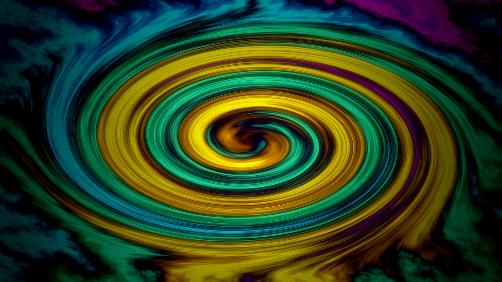

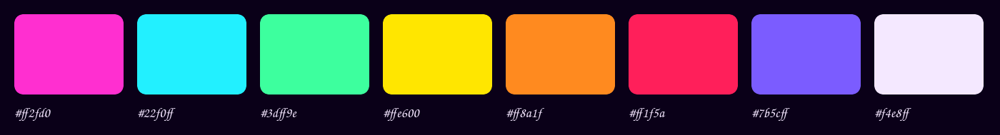

### Ego Death

Loads a GLSL shader over the whole compositor output, so the desktop itself
melts and hue-cycles in real time — windows, bar, cursor and all. Costs battery
and most of your ability to read small text. [Full
write-up](themes/ego-death/README.md).

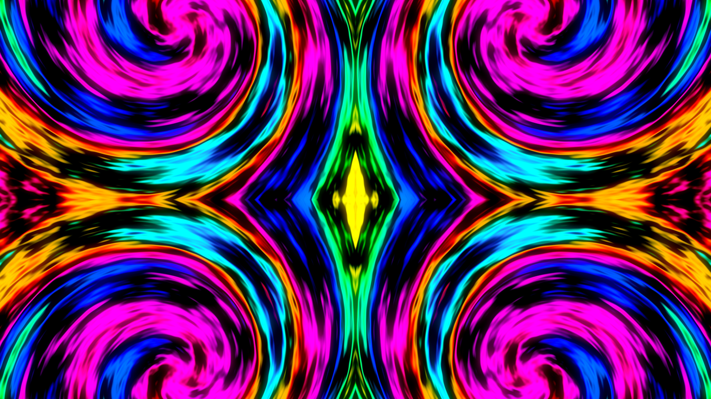

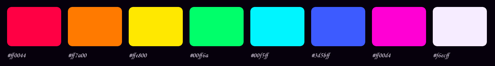

### Untitled

The most themeless theme ever themed. Grayscale, but derived rather than
chosen: the eight ANSI hues are ranked by Rec.709 luma and dealt onto an even
band of neutral gray, so hue is gone and only the order it implied survives. No
gradient, no rounding, no shadow, no blur, no transparency, and animations off
at the switch. [Full write-up](themes/untitled/README.md).


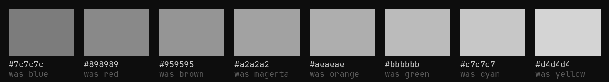

### Cathode

A terminal nobody ever switched off. Amber phosphor on near-black, and a second
GLSL shader over the whole compositor output — barrel distortion, 720 scanlines,
an aperture grille and phosphor bloom, so the desktop is not themed like a CRT,
it is displayed on one. One phosphor means one colour: every ANSI slot sits on
the same amber line and differs only in beam current, except `red`, which is the
single thing on the screen allowed to be a different colour at all. Costs
battery for the same reason Ego Death does. [Full
write-up](themes/cathode/README.md).

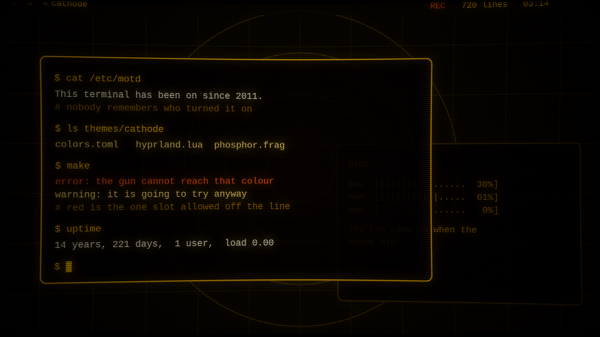

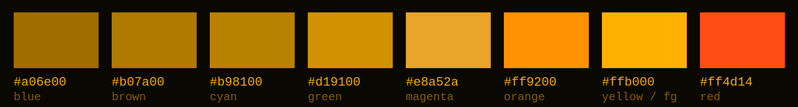

### Blueprint

Cyan-white ink on deep navy, drawn to a standard. The useful one: no shader, no
full-damage redraw, nothing over 120ms, every surface opaque, and a palette
built on a single rule — **every colour used as text clears 7:1 against the
background**, which is AAA rather than the 4.5:1 the rest of this repo sits on.
Red had to become pink to make that floor and the write-up says so. The excess
went into the rigour instead of the look: ISO 128 line weights, ISO 129
dimensioning, and wallpapers that are real technical sheets with zone strips,
ruler ticks, filed revision histories and drawn filing holes. [Full
write-up](themes/blueprint/README.md).

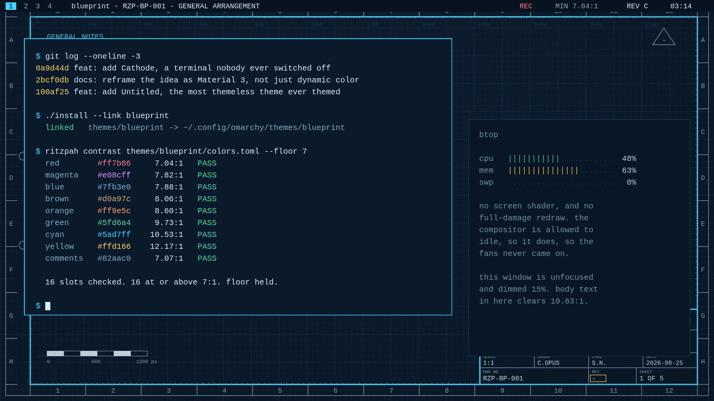

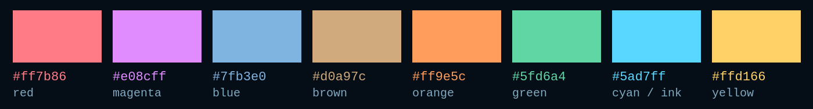

### Casino Carpet

Magenta, teal, gold, and a red that has no business being in the same room as
any of them. The Las Vegas floor-covering recipe, applied without mercy: a dark
saturated ground so nothing spilled on it ever shows, and a handful of very
loud, very high-chroma figures on top so the eye never settles anywhere long
enough to notice how long you have been here. Wallpapers are generated carpets
— Archimedean scrolls, starbursts, paisleys and stars, mirrored into wallpaper
group `pmm` — and the window border is a six-stop gradient that never stops
turning. The palette still clears 4.5:1 on all twenty slots, which is the
joke: nothing here is hard to read because of contrast. [Full
write-up](themes/casino-carpet/README.md).

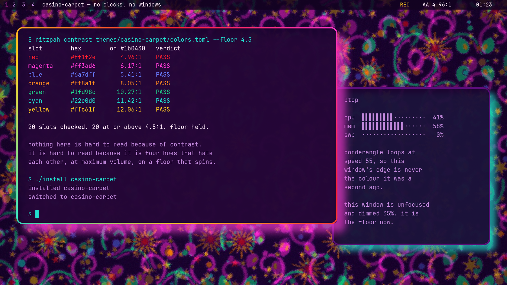

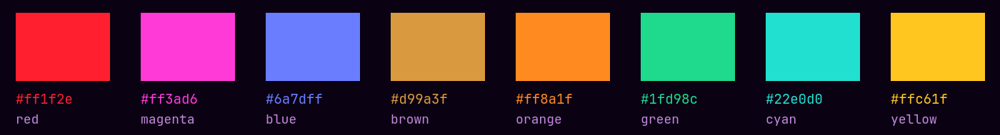

## Repo layout

```
install                               installer for the whole collection
themes/<name>/                        one theme, in Omarchy's own layout
tools/make-backgrounds                regenerates Acid Vortex's wallpapers
tools/make-backgrounds-ego-death      regenerates Ego Death's wallpapers
tools/make-backgrounds-untitled       regenerates Untitled's wallpapers
tools/make-backgrounds-cathode        regenerates Cathode's wallpapers
tools/make-backgrounds-blueprint      regenerates Blueprint's wallpapers
tools/make-backgrounds-casino-carpet  regenerates Casino Carpet's wallpapers
tools/make-palette-untitled           derives Untitled's colors.toml from scratch
docs/                                 preview images used by the READMEs
```

No wallpaper here was downloaded. Every generator builds its images from plasma
noise, gradients and drawing primitives with ImageMagick, so the recipes ship
instead of the provenance questions.

## Adding a theme

Drop a directory under `themes/`. The only required file is `colors.toml` —
that alone is enough for Omarchy to generate terminal, btop, neovim, Chromium,
and shell configs from the templates in `/usr/share/omarchy/default/themed/`.
Everything else is opt-in:

| File | Does |
|------|------|
| `colors.toml` | the palette; drives every generated config |
| `hyprland.lua` | borders, rounding, shadow, blur, animations |
| `shell.<section>.toml` | overrides one section of the generated `shell.toml` |
| `icons.theme` | one line, a Yaru variant |
| `backgrounds/` | wallpapers, cycled by `omarchy theme bg next` |
| `ghostty.conf` | replaces the generated one (restate the whole palette if you ship this) |
| `preview.png` | what shows up in this README |

A theme's `hyprland.lua` is loaded *before* `~/.config/hypr/looknfeel.lua`, so
anything you set there wins over the theme. Gaps and per-window opacity
generally live in your personal config; borders, rounding, blur, shadow and
animations are the theme's to own.

Shipping `shell.<section>.toml` files is safer than shipping a whole
`shell.toml` — Omarchy merges each one into the generated file and leaves the
other sections at their defaults.


## so I don't forget when I have more tokens!!!
```
calvin & hobbes

the far side

annoying (randomly timed subtle looknfeel changes to unnerve you, no loudness just erk)

not a theme but - ritzpah-roulette!! a shell script that mish-moshes every theme in the
  repo together in a completely and profoundly perplexed way: colors.toml from one theme,
  hyprland.lua from another, a wallpaper from a third, icons.theme from a fourth, shell
  sections dealt out at random. installs the chimera as a real theme called Roulette so
  omarchy cannot tell it was assembled by a coin. --seed N to reproduce a disaster you
  liked, --dry-run to see what it was about to do to you. only escape is
  `omarchy theme set "Acid Vortex"`

your computer is a website!!! famous website based themes

we need to make this a proper layer above the normal omarchy theme layer, so it can become an official plugin, ritzpah shall have it's "shim" to make it feel seamless and intergrated whil not being invasive

we need to restructre the github repo so the roster can be browsed properly (github pages deployment? netlify drop?)

add a dash cmd for claude helping users make a theme in one prompt

themes dynamicly built in real time based off of ridicoulous vars, like sports scores, the weather etc.
```


## License

MIT. See [LICENSE](LICENSE).
