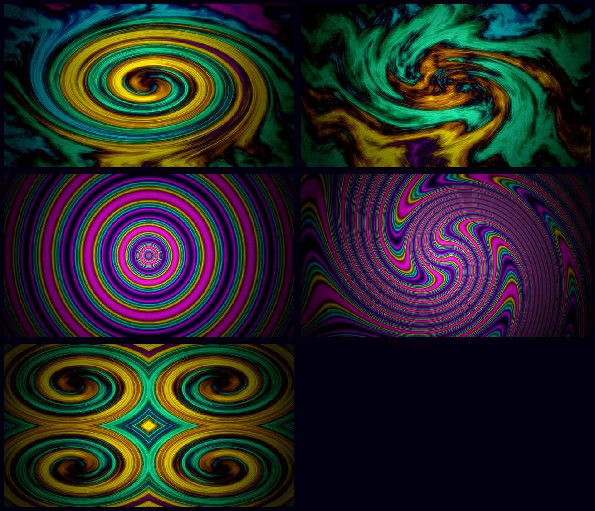

# Acid Vortex

Neon filaments on a violet void. Every window border is a five-stop rainbow
gradient that rotates forever.


## Palette

Deep violet-black grounds it (`#100024`), so the neons stay readable instead of
washing out.

| Role | Hex | |
|------|-----|-|
| background | `#100024` | violet void |
| foreground | `#f4e8ff` | |
| accent | `#ff2fd0` | hot magenta |
| cyan | `#22f0ff` | |
| green | `#3dff9e` | lime |
| yellow | `#ffe600` | acid |
| orange | `#ff8a1f` | |
| red | `#ff1f5a` | |
| blue | `#7b5cff` | |

## What it changes

**Borders spin.** `hyprland_active_border` is a five-stop gradient (magenta →
cyan → lime → yellow → magenta) and `hyprland.lua` loops the `borderangle`
animation at speed 40, so the gradient rotates continuously around every
focused window.

**Glow and frost.** Shadows are on — range 30, magenta on the focused window,
cyan on the rest. Blur runs at size 6 / 3 passes with vibrancy 0.35, and a
layer rule frosts the bar, menu, launcher, clipboard, and emoji picker.
Inactive windows dim 25%.

**Bouncy.** A custom bezier overshoots to 1.35, so windows pop in rather than
fade in.

**Shell surfaces.** Nine `shell.*.toml` section overrides. The bar sits at 55%
opacity over the wallpaper with cyan for active modules; menus, launcher,
notifications, and the lock input all wear the rotating gradient border.

## Wallpapers

Five, all synthesised from noise and gradients with ImageMagick — nothing
downloaded. Cycle them with `omarchy theme bg next`.



| | |
|---|---|
| `1-vortex` | swirled fractal plasma, 900° twist |
| `2-melt` | sine-warped liquid |
| `3-third-eye` | concentric sinusoid rings, imploded |
| `4-hyperspace` | polar-distorted rays, swirled into a tunnel |
| `5-kaleidoscope` | mirrored quadrant tiling |

The trick that keeps them from turning into a pastel smear: the grayscale field
is mapped through a lookup table of *narrow* neon bands separated by long
stretches of near-black, so smooth gradients come out as glowing contour lines.

Regenerate the whole set (each run differs — the plasma seed is random):

```bash
tools/make-backgrounds
tools/make-backgrounds ~/somewhere/else 3840 2160
```

## Turning it down

Two knobs in `hyprland.lua`:

- `blur.passes` — 3 is lush and costs GPU. Drop to 2, or set `blur.enabled =
  false`, if anything stutters.
- `dim_inactive` / `dim_strength` — 0.25 is a firm dim. Lower it, or set
  `dim_inactive = false`.

To stop the border rotating, delete the `borderangle` line.
