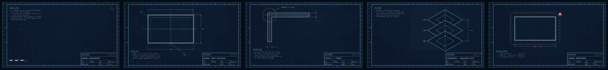

# Blueprint

Cyan-white ink on deep navy. The one theme in this repo that survives an
eight-hour workday.

That image is a **render, not a screenshot** — the windows, the bar and the
terminal output in it were all drawn in ImageMagick against the theme's own
values. Everything it shows is real, in the sense that the numbers on screen
are the numbers in `colors.toml`. Nothing was captured from a running desktop.

## The claim

Every colour in this theme that is ever used as text clears **7:1** against the
background.

7:1 is WCAG AAA for normal-size body text. It is not the number most dark
themes hit. The usual number is 4.5:1 — AA — and it is genuinely fine for an
hour. It is a different proposition at 16:40 on a bright day with the sun
behind you, which is when the low end of a palette stops being a design
decision and starts being a squint.

| Slot | Value | On `#0b1a2b` |
|------|-------|--------------|
| `red` | `#ff7b86` | **7.04:1** |
| `dark_foreground` (comments) | `#82aac0` | **7.07:1** |
| `magenta` | `#e08cff` | 7.82:1 |
| `blue` | `#7fb3e0` | 7.88:1 |
| `muted` | `#8fb4c9` | 7.97:1 |
| `brown` | `#d0a97c` | 8.06:1 |
| `orange` | `#ff9e5c` | 8.60:1 |
| `green` | `#5fd6a4` | 9.73:1 |
| `accent` | `#4dd2ff` | 10.01:1 |
| `bright_red` | `#ffb0b8` | 10.16:1 |
| `bright_magenta` | `#eeb0ff` | 10.27:1 |
| `bright_blue` | `#a8ccef` | 10.48:1 |
| `cyan` | `#5ad7ff` | 10.53:1 |
| `bright_green` | `#8fe8c8` | 12.15:1 |
| `yellow` | `#ffd166` | 12.17:1 |
| `bright_cyan` | `#a6e3ff` | 12.58:1 |
| `bright_yellow` | `#ffe29a` | 13.87:1 |
| `foreground` | `#d6ecf5` | 14.35:1 |
| `bright_foreground` | `#ffffff` | 17.55:1 |

The two bold rows are the ones the whole palette was built around. Everything
else had room to spare.

### What the floor cost

**Red is pink.** `#ff7b86` is not a red anybody would pick if they were picking
a red. It is the colour red became after being lightened until it cleared, and
it is lightened because red is the slot that always loses this argument: red
has low relative luminance and it is the one thing on a screen you must never
miss. Those two facts are in direct opposition and one of them has to give. On
a light background you give up nothing, because dark red is high-contrast
there. On a dark background you either accept a red at 4.5:1 or you accept a
pink.

The theme in the directory next door had this exact problem and wrote it down.
[Untitled](../untitled/README.md) ranks its palette by luma and reports the
result honestly: *"your errors are dimmer than your warnings."* That is what
happens when you let physics rank the palette. [Cathode](../cathode/README.md)
went the other way and cheated once — it has a single non-amber slot, spent
entirely on red, at 6.03:1.

Blueprint just pays. Red is the lowest-contrast thing here at 7.04:1, and
7.04:1 is still higher than any normal slot in either of those themes.

**Nothing is dark.** There is no "subdued" colour in this palette because a
subdued colour would not clear the floor. Where another theme would recede,
this one goes thinner: line weight, border width, fill alpha. That is a real
constraint and you can see it in every shell file.

**Dimmed comments fall through the floor.** `dim_inactive` is on at 0.15, which
takes 15% off both the text and the background of every unfocused window. Body
text survives that easily (10.63:1). `dark_foreground` does not: it was placed
at exactly 7.07:1, so dimming lands it on 5.36:1 — still AA, no longer AAA. If
you read code in unfocused windows all day, put `dim_inactive = false` in your
own `looknfeel.lua` and the floor holds everywhere. This is the only place in
the theme where a number goes the wrong way, and it is here because the
alternative — no dim at all — makes it harder to find the focused window, which
costs more than it saves.

## So where did "far too much" go

The house rule in [RITZPAH_SKILL.md](../../RITZPAH_SKILL.md) says a theme that
is "honestly pretty usable for daily driving" is in the wrong repo. This one is
in the right repo anyway, because the excess did not go into the look. It went
into the *rigour*.

- Line weights are **ISO 128**, which specifies them as a ratio (thin is half
  of thick) rather than as values, so the theme's entire weight scale is 2px
  and 4px and both numbers are derived.
- Dimensions on the wallpapers are **ISO 129**: extension lines, arrowheads
  inside the witnesses, the value sitting in a gap in the dimension line, and
  when the feature is too small for that, the arrowheads move outside and point
  back in. That last case is implemented. It fires exactly twice, on one sheet.
- The wallpapers carry a **zone strip** — twelve columns numbered, eight rows
  lettered — so any point on a wallpaper has an address you can say out loud.
  Nobody will ever say one out loud.
- They also carry **filing holes**, drawn, on a wallpaper, for a sheet of paper
  that does not exist.
- Every note block uses a **hanging indent**, so continuation lines get no
  number of their own and you can count the notes without reading them.
- There is a **revision history** for a colour scheme. Rev C is the one where
  red got lightened.

A theme that is genuinely restrained would have stopped at the palette. This
one drew a title block and filled in the checker's initials.

## The palette is a pencil tray

Hue is not decorative here, it is a legend. On a real set of construction
drawings the coloured pencils each mean something, and the meanings are how the
ANSI slots got assigned:

| Slot | Means |
|------|-------|
| `cyan` | the ink — visible edges, the drawing itself |
| `red` | revision markup, demolition, things that are wrong |
| `green` | existing to remain |
| `yellow` | highlighter, section marks, hold points |
| `orange` | temporary works, anything not yet approved |
| `blue` | notes, references to another sheet |
| `magenta` | setting-out points, reference geometry |
| `brown` | earth, existing grade, the table itself |

`red` is the only one of those that is enforced anywhere. It is used for the
bar's attention state, a failed polkit prompt, and a lock-screen error, and it
is used for nothing else, on any surface, ever. On the revision wallpaper every
red mark is markup and no red mark is part of the drawing. That is the deal:
red means *this is wrong*, so red never means anything else.

## Motion, timed rather than styled

Omarchy's defaults run windows at 379ms on an ease-out-quint and layers at
381ms. That is a nice curve. It is also long enough that you watch it happen.

**Nothing in this theme runs longer than 120ms.** That is under the rough
150ms threshold where a change stops reading as motion and starts reading as
having already finished. The animations are still on — they tell you which
direction a workspace went, which is information — they are just too short to
attend to.

Two curves, both of them things a drafting machine actually does:

| Curve | Points | Is |
|-------|--------|-----|
| `ruleSlide` | `{0,0} {1,1}` | dead linear. A parallel rule pushed along its track moves at the speed of your hand and does not accelerate. |
| `ruleStop` | `{0.16,0} {0.24,1}` | quick off the mark, decelerating into position, **no overshoot**. A set square brought up against a stop does not bounce. |

Windows `slide`; they do not `popin`. A window scaling up from 87% is a drawing
being enlarged, and enlarging a drawing changes its scale, which is the single
thing a scale bar exists to prevent. `borderangle` is disabled outright,
because a flat border has no angle to rotate.

Blueprint also turns **`workspaces` back on**, which Omarchy ships disabled.
Not for the look: a workspace that slides left tells you it was to the left.

## The rest of it

**Borders.** 2px, flat `#4dd2ff`, no gradient. A gradient along a line means
the line changes weight along its length, and on a drawing a line that changes
weight along its length means something else. Inactive is `#1d3b55`, which is a
line you can find and cannot read.

**Rounding.** `0`. Drawings have corners. The elevation wallpaper calls the
radius out as **R0** anyway, because a corner with no radius note is a corner
somebody forgot to specify.

**Snap.** `general:snap` is on at a 10px threshold, with `border_overlap` set,
so two floating windows that meet share one border line instead of drawing two
next to each other. A drafting board has a grid and everything on it lands on
the grid.

**`resize_on_border`.** On. A 2px border is a small grab target and it is still
the right one: the border is the edge of the object, so the edge of the object
is what you pull.

**No blur, no shadow.** Blur is a machine for making text less legible, which
is the entire opposite of the argument. A shadow is a claim that one window is
physically above another, and on a flat sheet nothing is above anything.

## Shell

Every surface is **fully opaque**. No frost, no `background-alpha` under 1.0
anywhere. Tracing paper laid over a drawing is how you end up reading both and
understanding neither.

Interactive states are a line-weight scale rather than a colour scale, with one
deliberate exception:

| State | Fill | Border | Width |
|-------|------|--------|-------|
| normal | 0.0 | `#1d3b55` | 1 |
| hover | 0.08 | `#3d6a8c` | 1 |
| **focus** | 0.10 | **`#4dd2ff`** | **2** |
| selected | 0.18 | `#4dd2ff` | 1 |
| pressed | 0.30 | — | — |

Focus is the exception. It is louder than hover on purpose: hover is where the
mouse happens to be sitting, focus is where the next keystroke is going, and
those are not equally worth knowing. The selected row composites to `#173b51`,
and its text is pure white — 11.79:1, the highest-contrast pairing anywhere in
the theme.

The launcher, menus and the image picker all use a **0.72 scrim**, which is
heavy. While the launcher is open it is the only thing you are reading, so
everything behind it stops competing for the eight seconds it is up.

## Wallpapers

| | |
|---|---|
| `1-sheet-a` | the daily driver: frame, zones, ticks, notes, scale bar, an empty middle |
| `2-elevation` | a front elevation of a Hyprland window, dimensioned, with a parts list |
| `3-detail` | DETAIL A at 4:1 — a section through the border, hatched at 45° |
| `4-isometric` | three workspaces in isometric projection, on an isometric grid |
| `5-revision` | the general arrangement back from the checker, clouded in red |

Sheet 1 is empty in the middle because a wallpaper you can still see at 17:00 is
a wallpaper with nothing in the middle of it. Everything interesting on it is
pushed to the margins, where your windows are not.

Regenerate with `tools/make-backgrounds-blueprint`. Unlike every other
generator in this repo, it draws **vector geometry** — MVG, ImageMagick's own
drawing language — rather than pushing plasma noise through a lookup table. A
drawing is the one thing you cannot get out of a random field; it has to be laid
out. Which also means these five are reproducible: same script, same images,
every time. The other generators in this repo are seeded from plasma and never
produce the same set twice.

Three things in that script worth knowing if you touch it:

- **All geometry is built at a fixed 2560×1440 and scaled at the end.** The
  alternative is computing every tick position against an arbitrary width, and
  a ruler whose ticks are not evenly spaced is not a ruler.
- **The lettering is monospaced**, which is both historically right — drafting
  lettering was cut with a stencil or a Leroy scriber, so every character had
  the same advance — and the only reason centred text can be positioned by
  arithmetic instead of by measurement. Liberation Mono advances 0.6em, so at
  20pt one column is exactly 12px.
- **Clipped layers multiply their alpha; they do not replace it.** Hatching and
  the isometric grid are drawn full-canvas and masked down. Doing that with a
  straight `CopyOpacity` from the mask sets every pixel inside the region
  opaque — including the ones that were never drawn on, which are transparent
  *black* — so the region comes out as a black rectangle with some lines in it.
  Extract the layer's own alpha, multiply the mask into that, put it back.

## Knobs

| Change | Effect |
|--------|--------|
| `dim_inactive = false` in your `looknfeel.lua` | comments in unfocused windows go back over 7:1 |
| raise the animation speeds toward `3.8` | Omarchy's default timings return |
| `animations = { enabled = false }` | Untitled's answer, one directory over |
| `border_size = 1` | the thin weight; the theme stops pointing at the focused window quite so hard |
| `rounding = 8` | and then delete the R0 callout, because it would be lying |
| any `background-alpha` below 1.0 | the wallpaper starts participating, and the contrast table stops being true |
| `snap.enabled = false` | floating windows stop landing on the grid |

Or leave: `omarchy theme set "Acid Vortex"`. There is a spinning rainbow
elsewhere in this repo, and two separate shaders that melt the compositor.
