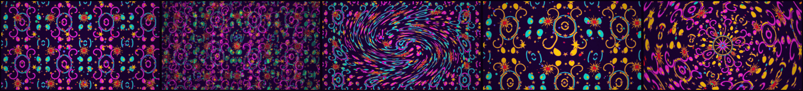

# Casino Carpet

Magenta, teal, gold, and a red that has no business being in the same room as
any of them.


That image is a **render, not a screenshot** — the windows, the bar, the
borders and the terminal output were all drawn in ImageMagick against the
theme's own values. The contrast figures on screen are the figures in
`colors.toml`. Nothing was captured from a running desktop.

## The claim

Every colour in this theme that is ever used as text clears **4.5:1** against
the background. All twenty of them.

That is WCAG AA for normal-size body text, and it is a deliberately ordinary
number — [Blueprint](../blueprint/README.md) holds a 7:1 floor and is the
better-behaved theme by a distance. The point here is not the height of the
floor. The point is that the floor *holds at all*, because the honest reaction
to a screenshot of this theme is that it must be unreadable, and the reason it
is unreadable has nothing to do with contrast.

| Slot | Value | On `#1b0430` |
|------|-------|--------------|
| `red` | `#ff1f2e` | **4.96:1** |
| `muted` | `#b06ad0` | 5.26:1 |
| `blue` | `#6a7dff` | 5.41:1 |
| `accent` / `magenta` | `#ff3ad6` | 6.17:1 |
| `bright_red` | `#ff6b7d` | 6.91:1 |
| `dark_foreground` (comments) | `#c48ade` | 7.26:1 |
| `brown` | `#d99a3f` | 7.81:1 |
| `orange` | `#ff8a1f` | 8.05:1 |
| `bright_blue` | `#9aa8ff` | 8.51:1 |
| `bright_magenta` | `#ff85e4` | 8.79:1 |
| `green` | `#1fd98c` | 10.27:1 |
| `cyan` | `#22e0d0` | 11.42:1 |
| `yellow` | `#ffc61f` | 12.06:1 |
| `bright_green` | `#6bf0b8` | 13.36:1 |
| `bright_cyan` | `#7af5ea` | 14.53:1 |
| `bright_yellow` | `#ffe066` | 14.55:1 |
| `foreground` | `#ffeaf9` | 16.62:1 |
| `light_foreground` | `#fff5fd` | 17.83:1 |
| `bright_foreground` | `#ffffff` | 18.98:1 |

Nineteen rows, because `accent` and `magenta` are the same value; twenty slots.
The lowest is red, and red is low on purpose.

### Red is the joke

`red` is deliberately the lowest-contrast slot in the palette **and** the one
that clashes hardest with the accent. `#ff1f2e` is a fire-engine scarlet,
`#ff3ad6` is a hot magenta. They are close in luminance and miles apart in hue,
which is precisely the condition the eye cannot resolve: put them side by side
and the boundary between them shimmers.

That is not a bug that survived review. That is the brief. A real casino floor
never does this — it separates every pair of saturated figures with a dark
keyline, for exactly this reason. This theme keeps the keyline everywhere
except the one place it would have helped most.

## What a casino carpet actually is

It is not "a busy pattern". It is a specific piece of industrial design solving
four problems at once, and every one of them left a fingerprint on this
palette:

1. **It has to hide thirty years of spilled drinks.** Hence a dark, highly
   saturated ground and no large flat areas anywhere. A stain is only a stain
   if you can find its edge. Here the ground is `#1b0430`, an aubergine — the
   colour a burgundy and a navy agree on after a long night. Never black; black
   shows lint.
2. **It has to survive being photographed under sodium light, halogen
   downlights, and whatever the sign outside is doing.** Hence colours at the
   top of the chroma range, which shift less alarmingly than pastels do.
3. **It is not supposed to be looked at.** The floor competes with several
   thousand backlit machines, so its job is to be uninteresting to rest on. It
   achieves that by never repeating anywhere the eye can catch it.
4. **It has to stop you noticing you have been in the building since Tuesday.**
   A small number of very loud, very high-chroma figures on a dark ground, so
   the eye never settles.

The last one is the only one this theme does not have a defence against.

## The wallpapers



Five of them, named for the parts of a floor you are moved through in order:
`1-high-limit`, `2-slot-floor`, `3-nickel-alley`, `4-comp-lounge`,
`5-no-clocks-no-windows`.

They are generated, not downloaded, by
[`tools/make-backgrounds-casino-carpet`](../../tools/make-backgrounds-casino-carpet).
Every figure on them is drawn from polar coordinates in `awk`, because bash has
no trigonometry and every shape involved — Archimedean spirals, n-pointed
stars, radial starbursts, paisleys — is defined in polar form:

- **Scrolls** are Archimedean spirals, `r = a + b·θ`. Archimedean rather than
  logarithmic on purpose: an Archimedean spiral has constant spacing between
  its turns, which is what a woven scroll looks like, because the yarn laying
  it down is a fixed width. A logarithmic spiral opens as it goes and reads as
  a nautilus, which is a completely different and much more tasteful object.
- **Every figure is stroked twice** — once fat in the plum keyline colour, once
  thinner in its own colour on top — because that dark outline is the entire
  reason the pattern reads as a pattern and not as a haze.
- **The layout is wallpaper group `pmm`**: two perpendicular mirror axes,
  achieved by drawing one quadrant and then flopping and flipping it. Almost
  every carpet like this is built that way.
- **The star repeat is deliberately not a simple ratio of the scroll repeat.**
  If it were, every second star would land in the same place relative to a
  scroll and the whole floor would snap into a grid, which is the one thing it
  must never do.

The plasma seeds are random, so every run produces a different set in the same
palette. The recipe is the deliverable; the exact image never was. Each output
is kept under 2 MB.

## What the compositor does

`hyprland.lua` is where "animations turned up" got taken literally.

- **The border is a six-stop gradient that never stops rotating.** Magenta,
  teal, gold, red, and the two hand-offs required to get between them without
  passing through anything tasteful — `borderangle` loops at speed 55. Every
  edge of the focused window is a different colour every second, and every
  boundary in it is a pair a carpet designer would have separated.
- **Rounding is 20 at `rounding_power` 2**, which pushes the corner toward a
  squircle. At this radius it stops reading as a rounded rectangle and starts
  reading as a casino chip.
- **Border size 4.** Three reads as a border; four reads as trim.
- **Unfocused windows dim 35%** and drop to the plum keyline. An unfocused
  window is the floor, and the floor is the one place your eye is allowed to
  rest.
- **Shadows are magenta on the focused window and teal on everything else**, so
  the two loudest hues are always both on screen and never on the same window.
- **Blur runs `vibrancy = 0.45`.** Vibrancy decides whether a blurred wallpaper
  keeps its chroma or turns into grey soup. The wallpapers are the theme, so it
  goes up.

**There is no screen shader here, and no full-damage redraw.** Unlike
[Ego Death](../ego-death/README.md) and [Cathode](../cathode/README.md), this
theme leaves `damage_tracking` alone, so the compositor idles when the screen
is still and the fans never come on. The only continuous animation is the
border angle on the focused window, which is one small quad. It is the loudest
theme in the repo and one of the cheapest.

## Where it goes quiet

Three surfaces deliberately stop being a carpet:

- **The lock screen** drops to `#0a0113`, fully opaque. No clocks, no windows,
  and now no way back in either. Partly because a lock screen gets read in bad
  light at the wrong angle, and partly because the joke only works if the floor
  stops for a moment.
- **The polkit prompt** does the same. You are about to type a secret into it,
  and the floor is not allowed to be doing anything while you do.
- **The launcher** takes the heaviest scrim in the repo, 0.82. With a wallpaper
  this busy, anything less and the pattern reads straight through the list you
  are trying to scan.

Error text on both dark surfaces is `red`, at 4.96:1 — the lowest contrast
anywhere in the theme, and still the most alarming object on the screen,
because everything around it has finally gone dark.

## Install

```bash
git clone https://github.com/lubabs770/ritzpah.git
cd ritzpah
./install casino-carpet
```

Regenerate the wallpapers with a fresh set of seeds:

```bash
tools/make-backgrounds-casino-carpet
```

The escape hatch, as always, is `omarchy theme set "Acid Vortex"` — or, if you
would like to keep your job, `omarchy theme set Blueprint`.
