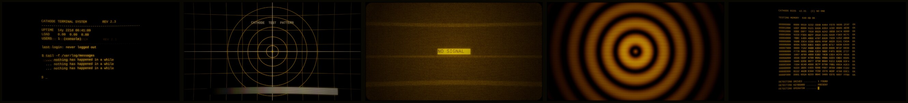

# Cathode

A terminal that nobody ever switched off.


That image is a **render, not a screenshot**. Everything in it — the bowed
picture, the scanlines, the bloom around the text, the corners falling off the
glass — is what `phosphor.frag` does to a live desktop, reproduced in
ImageMagick so the preview could be built without the shader running. The real
thing moves. This one cannot.

## The part that isn't a colour scheme

Like Ego Death, this theme loads a **GLSL fragment shader over the entire
compositor output** — `phosphor.frag`, wired up through `decoration:screen_shader`
in `hyprland.lua`. It runs on the finished frame and has no idea what a window
is, so it applies equally to windows, the bar, menus, video, and the cursor.

Where Ego Death melts the frame, this one *displays* it, on a tube:

- **Barrel distortion.** Sample coordinates are pushed outward from centre,
  harder the further out they start, so the picture bows toward you and the
  corners pull off the edge of the glass.
- **Phosphor bloom.** Five taps — centre plus four diagonals, screen-blended —
  so bright pixels spill into their neighbours. This is also the only
  persistence available (see below).
- **Scanlines.** A cosine on the vertical axis at a fixed **720 lines**, not one
  line per output pixel.
- **Aperture grille.** Every third *physical* pixel column loses 13% of its
  current. Barely visible on purpose; `MASK_DEPTH` is right there if you want
  corduroy.
- **One phosphor.** The frame's luminance is re-emitted in P3 amber and blended
  72% of the way back over the original, so the desktop keeps a trace of its own
  colours and loses the argument.
- **A roll bar** crawling up the screen every eight seconds, because the vertical
  hold never quite locked.
- **Mains hum** — a shallow brightness breath on the high-voltage supply.
- **Snow**, at about 2% amplitude, so black is never clean.
- **Vignette**, plus an idle glow: a powered tube with nothing to draw is not
  black, it is very dark amber.

Five texture samples and some trig per pixel. A CRT was a stupid device and this
is a cheap shader.

### The barrel has to be normalised, or the bar disappears

The obvious way to write barrel distortion is `c *= 1.0 + CURVE * r2`, and it
is wrong here. At `CURVE = 0.13`, the top edge of the screen gets dragged about
5% of the height off the glass — roughly 70px on a 1440p panel. Omarchy's bar is
26px tall. It would simply not be on the screen, and the first thing you would
do is assume the shell had crashed.

So the shader divides the whole thing back down:

```glsl
c *= (1.0 + CURVE * r2) / (1.0 + CURVE);
```

That pins the midpoint of every edge exactly where it started and lets only the
four corners fall away, which is what a real tube looks like anyway. The top of
the bar still loses a pixel or two at the very centre of the screen. That is the
distortion, working.

### It needs full damage to move

Hyprland only redraws damaged regions, and the shader's `time` uniform only
advances when a frame is drawn. Left alone, the roll bar, the hum and the snow
all freeze wherever the screen is still — you get a static photograph of a CRT
instead of a CRT. So the theme sets:

```lua
debug = { damage_tracking = 0 }
```

Full-screen redraws, continuously. **This is the expensive part, not the
shader** — the compositor never idles. On a laptop, expect the battery hit, and
expect the fans. If you are on battery and away from a charger, this is the
theme to leave.

(`misc.vfr` was the other half of this trick in older Hyprland; it was removed
by 0.56, so `damage_tracking` is the only knob now.)

### There is no persistence, and there cannot be

The one thing an amber tube is famous for — the smear a moving window leaves
behind — is not in here, because a Hyprland screen shader gets exactly one input
texture: the frame it is currently drawing. No history buffer, no previous
frame, nothing to decay. Real persistence needs somewhere to accumulate, and
there is nowhere.

What the shader does instead is spatial: the bloom taps spread each bright pixel
into its neighbours, which reads as glow rather than as trail. If a window drags
and you think you see a smear, that is the bloom plus your own visual system,
and you are welcome to keep it.

### Screenshots can stall while a screen shader is running

Same warning as Ego Death, same cause list, same fix. On Hyprland 0.56.2 a
`grim` capture taken during heavy theme reloading stalled for minutes, and every
later capture queued behind it — screencopy serialises, so one stuck request
looks exactly like a dead compositor. It clears on its own. Check before
assuming worse:

```bash
pgrep -a grim     # kill any leftovers, then try again
```

## The palette: one phosphor, eight beam currents

An amber CRT has a single phosphor layer and a single electron gun. It has no
mechanism for producing a hue. It can only produce more or less of the one
colour it has.

So every ANSI slot sits on the same amber line — `#ffb000`, P3 amber — and
differs only in how hard the gun is driven. `yellow` **is** the phosphor,
unmodulated. `bright_*` is the same phosphor with more current, which is why the
bright set runs toward white rather than toward a different hue.

| Slot | Value | Contrast on `#0a0803` |
|------|-------|-----------------------|
| `blue` | `#a06e00` | 4.50:1 |
| `brown` | `#b07a00` | 5.37:1 |
| `cyan` | `#b98100` | 5.91:1 |
| `red` | `#ff4d14` | 6.03:1 |
| `green` | `#d19100` | 7.40:1 |
| `orange` | `#ff9200` | 8.93:1 |
| `magenta` | `#e8a52a` | 9.39:1 |
| `yellow` / `foreground` | `#ffb000` | 10.93:1 |

`blue` lands on exactly 4.50:1, the WCAG floor, and so does `dark_foreground` at
`#a87000` — 4.75:1. Nothing in the normal set is allowed under it.

### The one exception, and why Untitled earned it

`red` is the only slot that leaves the amber line.

The theme in the next directory over, [Untitled](../untitled/README.md), ranks
its palette by luma and honestly reports what that cost: its errors came out
*dimmer* than its warnings, because red has low luminance and yellow has high
luminance and physics does not care which one you needed to notice.

Cathode does not repeat that. A monochrome tube cannot signal by hue at all, so
this theme cheats exactly once: `red` is pushed to `#ff4d14`, the red edge of
what the phosphor could plausibly reach, and it is **the only thing on the
screen that is not amber**. It sits sixth of eight by contrast and you will
still find it instantly, because difference beats brightness. Compiler errors,
a failed password, a lock-screen error and the bar's recording indicator are the
four places it is spent.

## The rest of it

**Borders.** 3px, a four-stop amber gradient at 90° that is hottest in the
middle and falls off toward the ends, like the middle of a tube. `borderangle`
loops slowly at speed 40. Unfocused windows get the bezel: two dark browns,
nearly invisible.

**Rounding.** `rounding = 16` at `rounding_power = 3`. The low power is
deliberate — a tube corner is a flattened curve, not a circle, and the default
power turns windows into lozenges.

**Blur.** Deliberately light: size 5, two passes. The shader is already smearing
the frame; stacking a heavy blur underneath it turns text into warm fog.
Inactive windows dim 30%, which reads as the gun not driving that part of the
screen as hard.

**Animations.** `crtSnap` moves almost all the way immediately and then settles.
`crtRing` overshoots to 1.35 — deflection is fast and then it rings. Windows
open at `popin 40%` (the tube warming up) and close at `popin 60%` on `crtDrain`
(the picture collapsing at power-off).

**Shell.** Everything is transparent enough for the roll bar to pass through it:
the bar at 0.35, menus and the launcher around 0.7. No control state changes
colour — hover, focus, selected and pressed differ only in fill alpha, which is
beam current.

**Terminal.** `ghostty.conf` replaces the generated one, so the whole palette is
restated in it. It adds `background-opacity = 0.78`, a non-blinking block
cursor, and `minimum-contrast = 1` — Ghostty's contrast rescue is off on
purpose, because the dim colours in this theme are supposed to be dim.

## Wallpapers



| | |
|---|---|
| `1-burn-in` | a session left up for fourteen years, with the session before it still ghosted underneath |
| `2-monoscope` | the test card a station forgot to take down: crosshair, circles, geometry grid, step wedge |
| `3-no-signal` | snow, three torn bands, and a caption |
| `4-degauss` | the half second after the button |
| `5-memory-check` | a power-on self test that never got past DETECTING OPERATOR |

None of these is a photograph of a monitor. Each one is drawn flat in amber and
then pushed through the same six-stage "tube" pass the shader runs live — bloom,
scanlines, aperture grille, barrel, rounded glass, vignette — so a window sitting
on a Cathode wallpaper does not look like it is on a different screen from the
wallpaper it is sitting on. Regenerate with `tools/make-backgrounds-cathode`.
The snow is generated at half resolution and scaled up, because full-resolution
random noise is both wrong-looking and a two-megabyte JPEG.

## Turning it down

In order of how much relief each one buys:

| Change | Effect |
|--------|--------|
| delete `debug = { damage_tracking = 0 }` | the roll bar, hum and snow freeze unless something else redraws; the compositor idles again, and the fans stop |
| delete the `screen_shader` line | no tube at all; the amber palette and the rest of the theme stay |
| `TINT = 0.0` in `phosphor.frag` | colours come back; everything else stays bowed and scanned |
| `SCAN_DEPTH = 0.12` | small text stops fighting the line structure |
| `CURVE = 0.0` | flat panel; the normalisation divide becomes a no-op on its own |
| `BLOOM = 0.2` | crisper text, much less glow |
| `background-opacity = 1.0` in `ghostty.conf` | an opaque terminal, which is genuinely easier to read |

Or just leave: `omarchy theme set "Acid Vortex"`. A theme switch reloads
Hyprland's config, which resets the shader and damage tracking to defaults.
