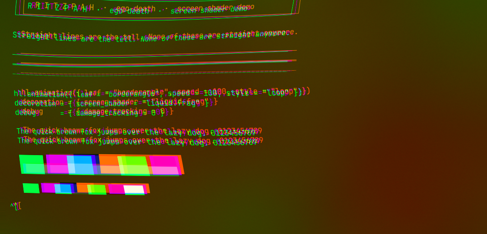
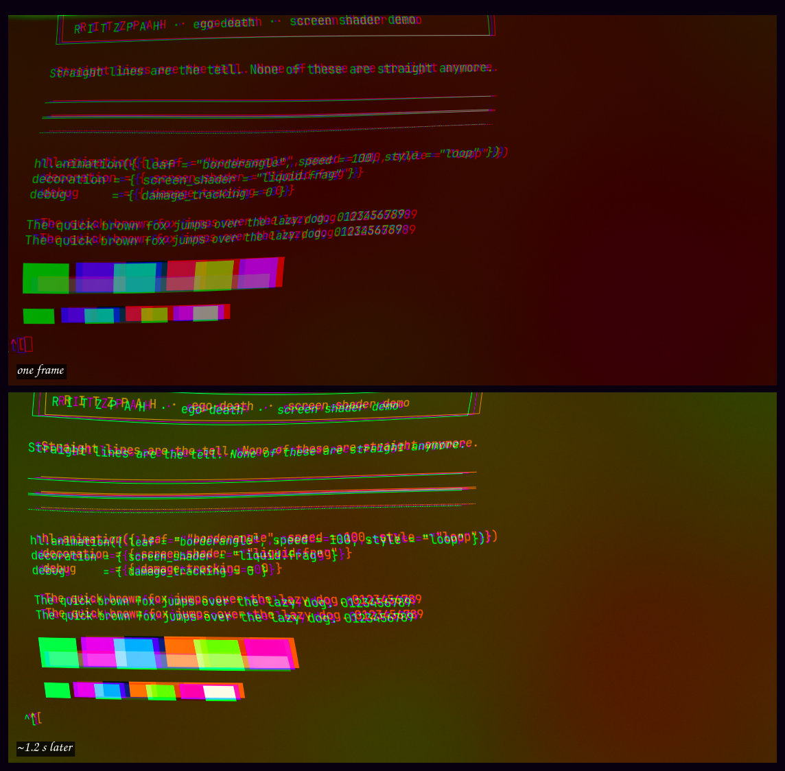
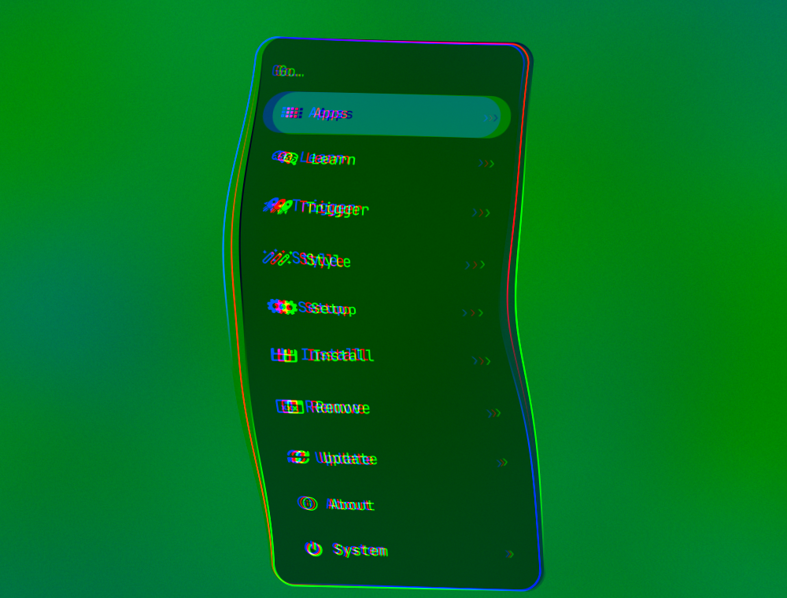
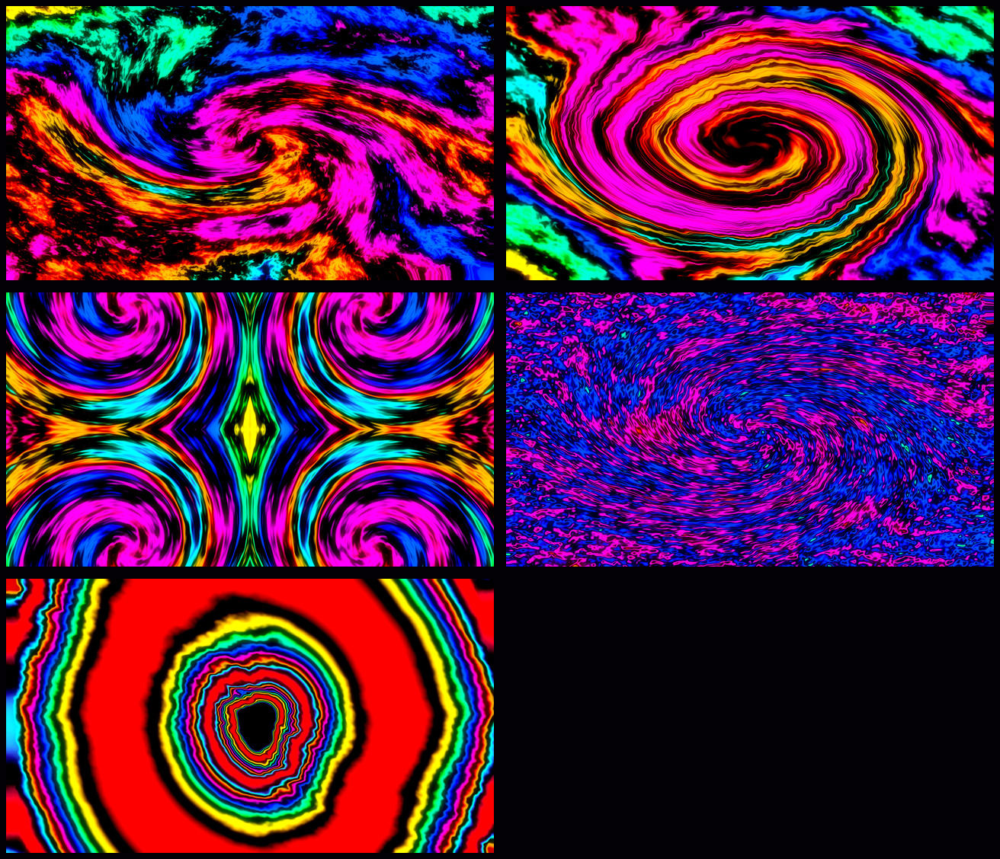

# Ego Death

Nothing is anything. Everything is something.


## What it actually looks like

The wallpaper above is just a wallpaper. This is the shader, captured live off
the compositor.

The screen below is a synthetic demo — a terminal printing nothing but rules,
box drawing, a pangram and some colour bars, specifically so there is a
straight line to compare against:



Note what is happening to the horizontal rules, and that every glyph has a red
copy and a blue copy pulling away from it in opposite directions. That is the
per-channel sampling offset, and it is the single biggest reason small text
stops being readable.

The same screen, about a second apart. Nothing moved and nothing was typed —
this is the warp phase and the hue rotation drifting on their own:



It applies to shell surfaces too, because the shader runs on the finished
frame and has no idea what a window is. The Omarchy menu, mid-melt — every
edge of that card is meant to be straight:



## The part that isn't a colour scheme

Every other Omarchy theme is static config. This one loads a **GLSL fragment
shader over the entire compositor output** — `liquid.frag`, wired up through
`decoration:screen_shader` in `hyprland.lua`.

That means the melt is not a wallpaper effect. It runs on the finished frame,
so it warps windows, the bar, menus, video, and the cursor alike. Every frame:

- two crossed sine fields drag the image around, at rates that don't share a
  period, so the churn never visibly loops;
- a ripple crawls outward from screen centre;
- the red, green, and blue channels are sampled at *different* offsets, so
  colour smears against itself and text ghosts;
- the whole frame is rotated through the colour wheel, faster toward the edges,
  so no region holds a colour;
- saturation breathes on a slow sine.

Three texture samples and a dozen trig ops per pixel — cheap enough that an
Intel UHD 620 doesn't notice the shader itself.

### It needs full damage to move

Hyprland only redraws damaged regions, and the shader's `time` uniform only
advances when a frame is drawn. Left alone, the melt freezes wherever the
screen is still. So the theme sets:

```lua
debug = { damage_tracking = 0 }
```

Full-screen redraws, continuously. **This is the expensive part, not the
shader** — the compositor stops idling. On a laptop, expect the battery hit.

(`misc.vfr` was the other half of this trick in older Hyprland; it was removed
by 0.56, so `damage_tracking` is the only knob now.)

### Screenshots can stall while the melt is running

On Hyprland 0.56.2, a `grim` capture taken during heavy theme reloading stalled
for several minutes instead of returning. While it was stalled, every later
screenshot queued behind it and appeared to hang too — screencopy serialises, so
one stuck request looks exactly like a dead compositor.

It cleared on its own once the stalled capture finally completed. No restart was
needed, and captures went back to taking about a second. If screenshots seem
dead under this theme, check for a stuck capture before assuming worse:

```bash
pgrep -a grim     # kill any leftovers, then try again
```

Cause unconfirmed. Full-damage rendering means every screencopy grabs a
freshly-rendered full frame, which is more work than usual, but that alone does
not explain a multi-minute stall.

## The rest of it

**Borders.** Eight stops, the entire colour wheel, `borderangle` looping at
speed 100. 5px wide, `rounding = 28` at `rounding_power = 8` — so windows are
blobs, not rectangles.

**Blur.** Size 10, four passes, vibrancy 0.6, noise 0.05, xray on. Inactive
windows dim 45%.

**Animations.** `egoWobble` overshoots to 1.6 — windows lurch past their target
and settle back. `egoOoze` is nearly the reverse, for anything leaving.

**Shell.** The bar sits at 25% opacity, menus and the launcher at 50–55%, all
of them frosted by a layer rule and wearing the eight-stop border.

**Terminal.** `ghostty.conf` overrides the generated one to add
`background-opacity = 0.65`. Text stays fully opaque; only the background goes
through.

## Wallpapers



| | |
|---|---|
| `1-dissolve` | plasma dragged through a second plasma field |
| `2-oil-slick` | swirled and imploded, then displaced |
| `3-mandala` | three rotations averaged into six-fold symmetry |
| `4-mercury` | shaded relief, liquefied |
| `5-event-horizon` | sinusoid rings collapsed inward and displaced |

Where Acid Vortex maps a clean field through narrow neon bands, these go
through the full spectrum *twice*, cut with dark bands so the colour reads as
ribbons rather than mush. Regenerate with `tools/make-backgrounds-ego-death`.

## Turning it down

In order of how much relief each one buys:

| Change | Effect |
|--------|--------|
| delete `debug = { damage_tracking = 0 }` | melt freezes unless something else redraws; compositor idles again |
| delete the `screen_shader` line | no melt at all; the rest of the theme stays |
| `blur.passes = 2` | much cheaper, still frosted |
| lower `ab` in `liquid.frag` | less colour-fringing on text — the single biggest readability win |
| lower the `0.0090` warp terms | less wobble |
| `dim_strength = 0.2` | inactive windows readable again |

Or just leave: `omarchy theme set "Acid Vortex"`. A theme switch reloads
Hyprland's config, which resets the shader and damage tracking to defaults.
