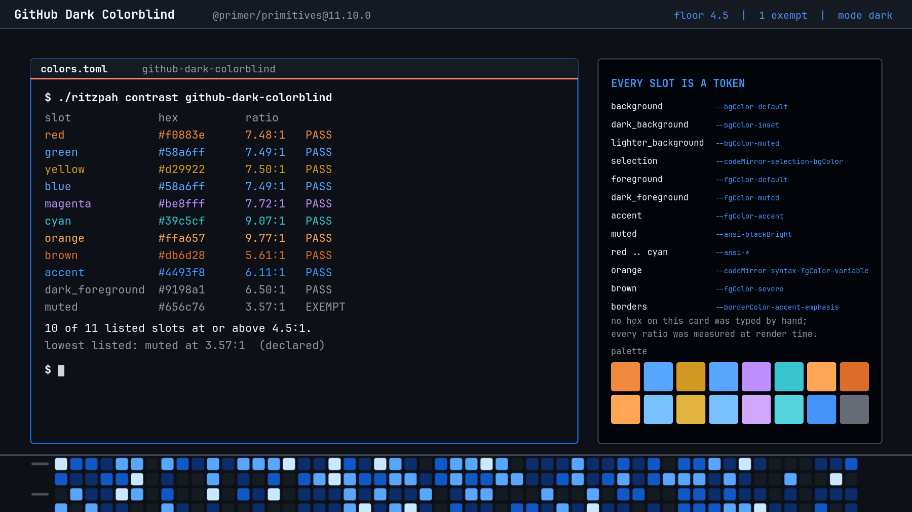
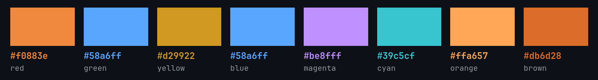
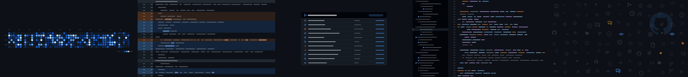

# GitHub Dark Colorblind

Red and green stop being red and green. Everything else stays exactly where it
was.

The machinery — how the tokens are fetched, what maps to what, why the borders
and curves are the numbers they are — is written up once, next door in
[GitHub Dark](../github-dark/README.md). This file is the diff.

## What changed: four slots

This is the smallest diff in the family, and that is the design. GitHub's
colorblind theme is the default dark theme with the **red/green axis** replaced
by an orange/blue one — the axis deuteranopia and protanopia sit on. Nothing
else is touched: same canvas, same foreground, same yellow, magenta, cyan,
borders, shadows and curves.

| Slot | Dark | Colorblind |
|------|------|------------|
| `red` | `#ff7b72` | `#f0883e` — orange |
| `green` | `#3fb950` | `#58a6ff` — blue |
| `bright_red` | `#ffa198` | `#ffa657` |
| `bright_green` | `#56d364` | `#79c0ff` |

Contrast is untouched by all of this: the palette measures identically to the
default theme on every unchanged slot, and the four that moved land at 7.48–9.77:1.
One exemption, `muted` at 3.57:1, for the same reason as everywhere else in this
family.

## The thing you should know before installing it

**Three pairs of ANSI slots now collide.**

| Same colour | Slots |
|-------------|-------|
| `#58a6ff` | `green`, `blue` |
| `#79c0ff` | `bright_green`, `bright_blue` |
| `#ffa657` | `orange`, `bright_red` |

On github.com that is not a problem, because a diff has a `+` and a `-` in the
gutter and a check has a tick or a cross inside the circle — the colour is
reinforcement, never the only signal. A terminal is less careful. `ls` will
paint a directory and an executable the same blue, and a build log that
distinguishes a pass from a fail *only* by ANSI green versus ANSI blue will
stop distinguishing them.

That is not a flaw introduced here — it is what happens when you take an
interface palette designed with redundant cues and use it as a terminal palette,
and it is the honest cost of running GitHub's colorblind theme in a shell. It is
written down rather than smoothed over, because smoothing it over would have
meant inventing a green, and this theme does not invent colours.

## The one substitution this theme does make

The contribution graph on the wallpaper is drawn with Primer's **`winter`**
scheme rather than `default`.

Here is why, in full, because it is the only place in five themes where a
judgement call was made instead of a token being read. Primer publishes
`--contribution-default-bgColor-0` through `-4`, and their values are
**identical** in `dark`, `dark-colorblind` and `dark-tritanopia` — all three
green. GitHub does the accessibility swap in the application, not in the token
set, so reading the tokens faithfully would have produced a *green* contribution
graph on a colorblind theme, sitting next to a terminal whose green had been
replaced with blue.

Primer also publishes a `winter` contribution scheme whose level 3 is exactly
`#58a6ff` — the same blue this variant substitutes for ANSI green. Using it
means the wallpaper and the palette agree, and no hex was invented to get there.

It is still a substitution GitHub does not make in its tokens. That sentence is
the reason this section exists.

## Everything else

Identical to [GitHub Dark](../github-dark/README.md): 2px borders in
`--borderColor-accent-emphasis`, 6px rounding, `--shadow-floating-small`, no
blur, no dim, Primer's four easing curves at 100 and 200ms, the orange tab rule,
and ten shell sections off the same tokens.

## Wallpapers

The same five drawings, redrawn from this variant's tokens — so the diff
wallpaper's additions are blue, its deletions are orange, and the checks card's
status circles follow. Regenerate with `tools/make-backgrounds-github`.

Icons are real: [`@primer/octicons`](https://github.com/primer/octicons)
19.33.0, MIT, © GitHub Inc.

## Knobs

| Change | Effect |
|--------|--------|
| `omarchy theme set "GitHub Dark Tritanopia"` | the other axis: blue/yellow rather than red/green, [next door](../github-dark-tritanopia/README.md) |
| `omarchy theme set "GitHub Dark"` | red is red again, and the three collisions go away |
| giving `blue` a distinct value in your own copy | fixes `ls` and breaks the premise |
