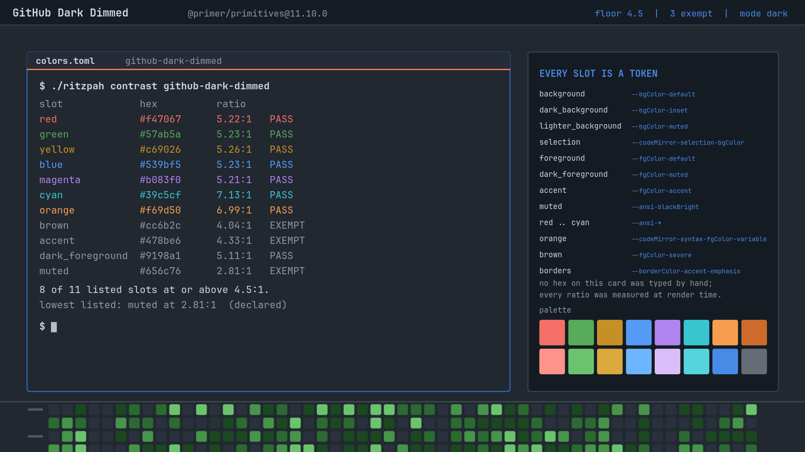
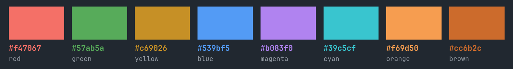
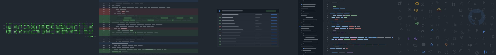

# GitHub Dark Dimmed

GitHub's Dimmed: the same interface on lighter paper, and every ratio in the
palette pays for it.

The machinery — how the tokens are fetched, what maps to what, why the borders
and curves are the numbers they are — is written up once, next door in
[GitHub Dark](../github-dark/README.md). This file is the diff.

## What actually changed

**Nineteen of twenty ink slots.** Dimmed is not the default theme with a
different background; Primer republishes almost the whole scale. The canvas goes
`#0d1117` → `#212830`, the default foreground comes *down* from `#f0f6fc` to
`#d1d7e0`, and every hue is re-picked for the new surface:

| Slot | Dark | Dimmed |
|------|------|--------|
| `background` | `#0d1117` | `#212830` |
| `foreground` | `#f0f6fc` | `#d1d7e0` |
| `red` | `#ff7b72` | `#f47067` |
| `green` | `#3fb950` | `#57ab5a` |
| `blue` | `#58a6ff` | `#539bf5` |
| `magenta` | `#be8fff` | `#b083f0` |
| `accent` | `#4493f8` | `#478be6` |

That is the interesting thing about Dimmed and the reason it is worth shipping
separately: it is a *whole second palette*, not a background swap.

## The cost, in numbers

Lifting the canvas costs contrast everywhere, because contrast is a ratio and
the denominator got brighter. The default theme's body text sits at 17.39:1.
Dimmed's sits at **10.28:1** — still excellent, and still a third of the
headroom gone.

At the bottom of the scale the headroom runs out. Dimmed carries **three**
exemptions where the default theme carries one:

| Slot | Value | Ratio | Why it is exempt |
|------|-------|-------|------------------|
| `muted` | `#656c76` | 2.81:1 | ANSI 8 is GitHub's dimmed-text value and dimmed text is supposed to recede |
| `brown` | `#cc6b2c` | 4.04:1 | `--fgColor-severe`, unchanged in spirit from the default theme; it only looks worse because the paper got lighter |
| `accent` | `#478be6` | **4.33:1** | GitHub ships this link colour below AA |

The last row is the one to read twice. `--fgColor-accent` in Dimmed measures
4.33:1 against `--bgColor-default`. That is under AA. It is not a mistake in
this theme — it is what GitHub publishes, and the whole premise here is that the
tokens are the tokens.

This is exactly where the build stopped and refused to continue. The generator
hard-fails on any slot under the floor with no written reason, printing *"Do not
lower the floor."* The options at that point were to lighten GitHub's link
colour — shipping a link blue GitHub does not have, in a theme whose entire
claim is fidelity — or to write down what was found and let the number stand
where anyone can see it. The second one is what an exemption is for.

Everything else in Dimmed clears 4.5:1, and most of the palette lands in the
5.2–7.0 band: comfortable, unemphatic, and noticeably softer than the default
theme. That softness is the point of Dimmed. It is also the reason to know that
links are the softest thing on the screen.

## Everything else

Identical to [GitHub Dark](../github-dark/README.md), because Primer's border
widths, radii, shadows and easing curves are **not** per-theme tokens — they are
the same values in every variant, and a theme that varied them would be
inventing something. Borders 2px, rounding 6px, no blur, no dim, four Primer
curves at 100 and 200ms, and the orange tab rule.

Most shell surfaces do move, because they are colour: the launcher, menus and
controls all sit on Dimmed's own three-state button scale. The bar does not.
`--header-bgColor` is `#151b23f1` in every dark variant GitHub publishes,
Dimmed included — the global header stays at the default theme's darkness even
when the page under it lightens, which is a decision GitHub made and this theme
is not in the business of second-guessing.

## Wallpapers

The same five drawings as the default theme, redrawn from Dimmed's tokens —
including the contribution graph, which uses Primer's `default` contribution
scheme here exactly as GitHub does. Regenerate with
`tools/make-backgrounds-github`.

Icons are real: [`@primer/octicons`](https://github.com/primer/octicons)
19.33.0, MIT, © GitHub Inc.

## Knobs

| Change | Effect |
|--------|--------|
| `omarchy theme set "GitHub Dark"` | the default theme, 17.39:1 body text, seven points of headroom back |
| `omarchy theme set "GitHub Dark High Contrast"` | the opposite end of the same family |
| overriding `accent` in your own copy | fixes the 4.33:1 link, and the theme stops being GitHub's |
