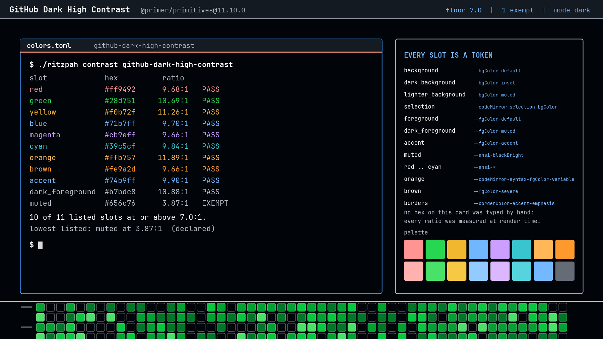
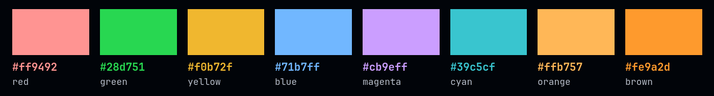
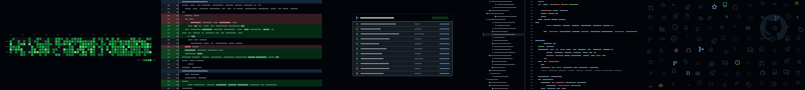

# GitHub Dark High Contrast

The most readable theme in this repo, and it did not set out to be.

The machinery — how the tokens are fetched, what maps to what, why the borders
and curves are the numbers they are — is written up once, next door in
[GitHub Dark](../github-dark/README.md). This file is the diff.

## The claim

**Every ink slot but one clears 9.66:1.**

Not 4.5, which is AA. Not 7.0, which is AAA and which
[Blueprint](../blueprint/README.md) built its entire palette around and reached
at 7.04:1 on its worst slot. This theme's *worst passing slot* is 9.66:1, and it
gets there without anybody choosing a colour.

| Slot | Value | Ratio |
|------|-------|-------|
| `muted` | `#656c76` | **3.87:1 — exempt** |
| `magenta` | `#cb9eff` | 9.66:1 |
| `brown` | `#fe9a2d` | 9.66:1 |
| `red` | `#ff9492` | 9.68:1 |
| `blue` | `#71b7ff` | 9.70:1 |
| `cyan` | `#39c5cf` | 9.84:1 |
| `accent` | `#74b9ff` | 9.90:1 |
| `green` | `#28d751` | 10.69:1 |
| `dark_foreground` | `#b7bdc8` | 10.88:1 |
| `yellow` | `#f0b72f` | 11.26:1 |
| `orange` | `#ffb757` | 11.89:1 |
| `foreground` | `#ffffff` | **20.54:1** |

The floor declared in `theme.json` is **7.0**, raised from the 4.5 the other
four variants use, because a theme called High Contrast that only promised AA
would be making a claim it could not be held to. Every slot clears it by at
least two and a half points.

Two things are doing the work. The canvas is `--bgColor-default` = `#010409`,
which is very nearly black — the default theme's `#0d1117` is a *blue-grey*, and
this one is not. And the foreground is pure `#ffffff` rather than `#f0f6fc`. The
ends of the scale are pushed as far apart as they can go, and every hue is then
re-picked against the new bottom.

Note the row that did not move: `dark_foreground` — the comment colour — goes
from `#9198a1` at 6.50:1 in the default theme to `#b7bdc8` at **10.88:1** here.
In most high-contrast themes comments are the thing that gets sacrificed. In
this one they are brighter than eight of the hues.

## The one exemption

`muted`, ANSI 8, `#656c76`, at 3.87:1 — the same value as in every other GitHub
variant, because `--ansi-blackBright` is one of the tokens Primer does *not*
re-pick for high contrast.

That is worth saying plainly rather than burying: **GitHub's high-contrast dark
theme still ships a dimmed-text colour under AA.** The exemption records it,
with the measured number, and the validator warns if that number ever goes
stale. Lifting it would mean shipping a terminal palette GitHub does not have.

If the low ANSI 8 is the thing that bothers you, it is one line in your own copy
— and then the theme is yours rather than GitHub's, which is a fair trade to
make deliberately and a bad one to make by accident.

## Everything else

Identical to [GitHub Dark](../github-dark/README.md). Primer's border widths,
radii, shadows and easing curves are not per-theme tokens, so this variant
inherits them unchanged: 2px borders, 6px rounding, no blur, no dim, four Primer
curves at 100 and 200ms, and the orange tab rule at `#f78166`.

The borders themselves *are* colour, and they move with the theme —
`--borderColor-accent-emphasis` is brighter here, and against a near-black
canvas the focus ring is unmissable. `--borderColor-default` goes all the way up
to `#b7bdc8`, which means even an **unfocused** window has a fully legible
outline. On the default theme the inactive border is `#3d444d` and is, correctly,
something you have to look for.

The bar is the exception in the other direction: `--header-bgColor` is
`#151b23f1` in every dark variant including this one, so the global header sits
*lighter* than the page it floats over. GitHub does that on purpose and so does
this.

## Wallpapers

The same five drawings, redrawn from this variant's tokens. On a `#010409`
canvas the diff wallpaper's addition and deletion bands are the most visible
they get anywhere in the family, and the contribution graph — Primer's `default`
scheme here, as GitHub uses — reads at a glance from across the room.

Regenerate with `tools/make-backgrounds-github`. Icons are real:
[`@primer/octicons`](https://github.com/primer/octicons) 19.33.0, MIT,
© GitHub Inc.

## Knobs

| Change | Effect |
|--------|--------|
| `omarchy theme set "GitHub Dark"` | the default theme; ~7.5:1 on the hues instead of ~9.7:1 |
| `omarchy theme set "GitHub Dark Dimmed"` | the far end: lighter paper, three exemptions, links at 4.33:1 |
| `border_size = 1` | GitHub's resting width; on this canvas the ring survives it |
| raising `muted` in your own copy | the only slot under the floor, and no longer GitHub's value |
