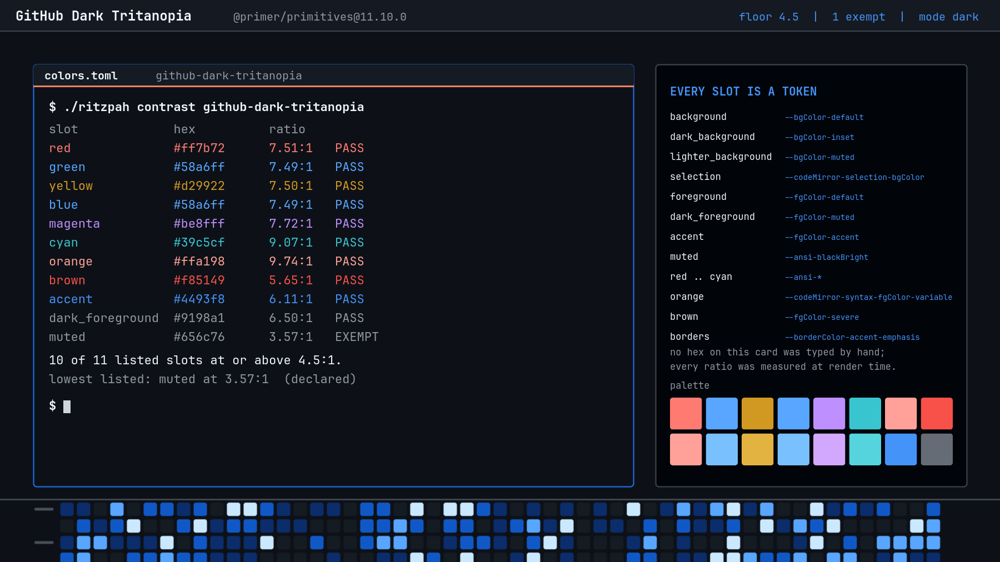
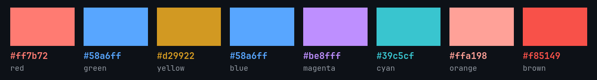
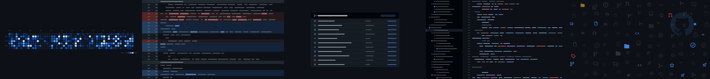

# GitHub Dark Tritanopia

Green becomes blue and red stays red. It is the smallest-looking change in the
family and it is on a completely different axis from the one you expect.

The machinery — how the tokens are fetched, what maps to what, why the borders
and curves are the numbers they are — is written up once, next door in
[GitHub Dark](../github-dark/README.md). This file is the diff.

## What changed: four slots

Tritanopia is blue-yellow colour blindness, not the red-green kind. So this
variant does something the [Colorblind](../github-dark-colorblind/README.md)
theme deliberately does not: **it keeps ANSI red exactly where it was.**

| Slot | Dark | Tritanopia |
|------|------|------------|
| `green` | `#3fb950` | `#58a6ff` — blue |
| `bright_green` | `#56d364` | `#79c0ff` |
| `orange` | `#ffa657` | `#ffa198` — pink-red |
| `brown` | `#db6d28` | `#f85149` — red |

`red` is untouched at `#ff7b72`. What moves instead is everything *near* orange:
`--fgColor-severe`, the level above warning, goes from orange-brown to outright
red, and the syntax orange shifts pink. The pattern is consistent — the warm
range collapses toward red so that nothing important is distinguished by a
yellow-versus-blue judgement.

You can see the same logic in the diff colours. GitHub's addition background
moves from green `#12261e` to blue `#132339`, and the deletion background stays
red at `#25181c` — where the Colorblind variant moves the deletion to orange
`#2c1f1a` because *that* theme cannot rely on red. Two themes, two different
axes, two different answers to the same question.

Contrast is unchanged on every untouched slot and 5.65–9.74:1 on the four that
moved. One exemption, `muted` at 3.57:1, for the same reason as everywhere else
in this family.

## The thing you should know before installing it

**Three pairs of ANSI slots now collide.**

| Same colour | Slots |
|-------------|-------|
| `#58a6ff` | `green`, `blue` |
| `#79c0ff` | `bright_green`, `bright_blue` |
| `#ffa198` | `orange`, `bright_red` |

github.com never depends on colour alone — a diff has `+`/`-` in the gutter, a
check has a glyph inside the circle. A terminal frequently does. `ls` paints
directories and executables the same blue here, and anything that separates a
pass from a fail using only ANSI green and ANSI blue stops separating them.

That is the real cost of using an interface palette as a terminal palette, and
it is written down rather than papered over. Papering over it would have meant
inventing a green.

## The one substitution this theme does make

The contribution graph on the wallpaper uses Primer's **`winter`** scheme rather
than `default`.

Primer's `--contribution-default-bgColor-*` values are **identical** across
`dark`, `dark-colorblind` and `dark-tritanopia` — all three green. GitHub
performs the accessibility swap in the application rather than in the token set,
so reading the tokens faithfully would have put a green contribution graph
behind a terminal whose green is blue. Primer's `winter` scheme has level 3 at
exactly `#58a6ff`, the same blue this variant uses, so the wallpaper and the
palette agree and nothing was invented to make them agree.

It remains a substitution GitHub does not make in its tokens, which is why it is
in the README rather than only in a comment.

## Everything else

Identical to [GitHub Dark](../github-dark/README.md): 2px borders in
`--borderColor-accent-emphasis`, 6px rounding, `--shadow-floating-small`, no
blur, no dim, Primer's four easing curves at 100 and 200ms, the orange tab rule
at `#f78166`, and ten shell sections off the same tokens.

## Wallpapers

The same five drawings, redrawn from this variant's tokens: blue additions, red
deletions, and a blue contribution graph. Regenerate with
`tools/make-backgrounds-github`.

Icons are real: [`@primer/octicons`](https://github.com/primer/octicons)
19.33.0, MIT, © GitHub Inc.

## Knobs

| Change | Effect |
|--------|--------|
| `omarchy theme set "GitHub Dark Colorblind"` | the red/green axis instead, [next door](../github-dark-colorblind/README.md) |
| `omarchy theme set "GitHub Dark"` | green is green again, and the three collisions go away |
| giving `blue` a distinct value in your own copy | fixes `ls` and breaks the premise |
