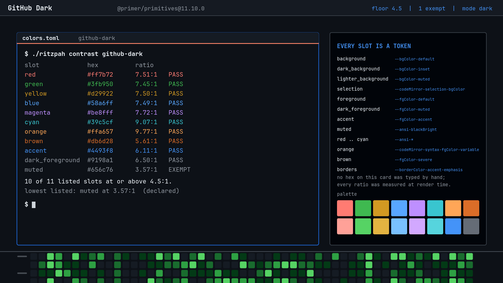
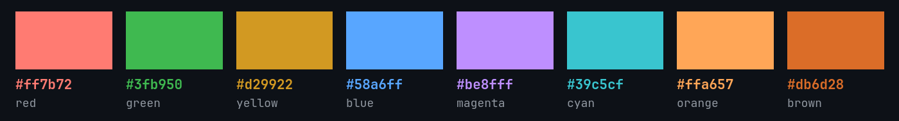
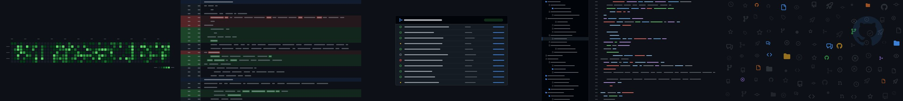

# GitHub Dark

GitHub's default dark mode, taken off the design tokens and pressed onto the
whole desktop.

That preview is a **render, not a screenshot**. The terminal output in it is
real in the sense that matters: the hexes are the hexes in `colors.toml` and
the ratios were measured at render time by the same code `./ritzpah contrast`
runs. Nothing was captured from a running desktop, and no number on that card
was typed by a human.

This is the reference variant. The other four GitHub themes in this repo are
diffs against it, and their READMEs say only what is different.

## Nothing here was picked

Every colour, border width, corner radius, shadow and easing curve in this
theme is a **published GitHub design token**. `tools/make-github-themes` fetches
[`@primer/primitives`](https://github.com/primer/primitives) 11.10.0 from the
npm registry, parses the functional theme CSS, resolves `var()` chains down to
literal values, flattens any alpha onto the surface underneath it, and writes
the result out as `colors.toml`, `hyprland.lua` and ten `shell.*.toml` files.

There are **959 tokens** in each dark variant's CSS. Every one of them is
declared exactly twice with identical values — the generator checks that and
refuses to run if a token ever disagrees with itself, rather than quietly
taking the last one it saw.

The mapping is the whole theme, so it is written down in the generator next to
each slot, with the reason:

| Slot | Token |
|------|-------|
| `background` | `--bgColor-default` |
| `dark_background` | `--bgColor-inset` |
| `lighter_background` | `--bgColor-muted` |
| `selection` | `--codeMirror-selection-bgColor` |
| `foreground` | `--fgColor-default` |
| `dark_foreground` | `--fgColor-muted` |
| `accent` | `--fgColor-accent` |
| `muted` … `bright_cyan` | `--ansi-*`, GitHub's own terminal palette |
| `orange` | `--codeMirror-syntax-fgColor-variable` |
| `brown` | `--fgColor-severe` |

Two of those need defending. Omarchy's palette has twenty ink slots and ANSI
has sixteen names, so `orange` and `brown` have no `--ansi-` token to come
from. Rather than invent two hexes, they take the closest thing GitHub does
publish: the orange it colours variables in a code block, and the orange-brown
it uses for the severity level above warning. Both clear the floor comfortably
(9.77:1 and 5.61:1), which is the other reason to prefer a real token over a
convenient one — a made-up colour would also have been a made-up ratio.

## The contrast

Floor **4.5:1** — AA for body text — against `#0d1117`.

| Slot | Value | Ratio |
|------|-------|-------|
| `muted` | `#656c76` | **3.57:1 — exempt** |
| `brown` | `#db6d28` | 5.61:1 |
| `accent` | `#4493f8` | 6.11:1 |
| `dark_foreground` | `#9198a1` | 6.50:1 |
| `green` | `#3fb950` | 7.45:1 |
| `blue` | `#58a6ff` | 7.49:1 |
| `yellow` | `#d29922` | 7.50:1 |
| `red` | `#ff7b72` | 7.51:1 |
| `magenta` | `#be8fff` | 7.72:1 |
| `cyan` | `#39c5cf` | 9.07:1 |
| `orange` | `#ffa657` | 9.77:1 |
| `foreground` | `#f0f6fc` | 17.39:1 |

Nineteen of twenty slots pass; most of them clear AAA without being asked to.
The exemption is `muted`, ANSI 8, at 3.57:1 — and it is exempt rather than
lifted because `--ansi-blackBright` is GitHub's dimmed-text value and dimmed
text is supposed to recede. Lightening it would mean shipping a terminal
palette GitHub does not have, which is the one thing this theme is not allowed
to do. **An exemption is not a way to lower the floor**: it is a written
argument for one slot, and the validator warns if the number in it goes stale.

The generator enforces this from the other direction too. Any slot that comes
in under the floor without a reason already written for it is a **hard failure**
— it stops the build and prints *"Do not lower the floor."* That is not
theoretical; it fired during construction, on Dimmed, and the fix was to write
the argument rather than to move the number.

## Hyprland

`hyprland.lua` is nine tokens and four curves.

**Borders — 2px, `#1f6feb`.** That is `--borderWidth-thick` and
`--borderColor-accent-emphasis`, GitHub's focus ring. GitHub actually draws a
resting border at 1px and a focused one at 2px; Hyprland has one width for both
states, so the theme takes the focus width and lets the colour carry the state.
Inactive is `--borderColor-default`, `#3d444d`. The file says all of this out
loud rather than rounding it away quietly.

**Rounding — 6px.** `--borderRadius-medium`, which Primer also aliases as
`--borderRadius-default` and documents as the *"preferred default border radius
for standard UI components"*. A window is a standard UI component.

**Shadow — `--shadow-floating-small`**, minus its `0 0 0 1px` layer. That layer
is a border drawn as a shadow so it survives a layout shift. Hyprland has a
real border and does not need the trick.

**No blur.** There is no blur token in Primer, because there is no blur in the
product. GitHub is a document and you cannot see through a document.

**No `dim_inactive`.** GitHub never dims a page for being unfocused. It has
`--bgColor-disabled` for controls that cannot be used, and an unfocused window
is not a disabled one.

**The motion is GitHub's motion, not an impression of it.** A CSS
`cubic-bezier` and a Hyprland bezier are the same four numbers in the same
order, so Primer's easing curves transplant whole — including the note Primer
ships with each one saying what it is for:

| Curve | Points | Primer's own note |
|-------|--------|-------------------|
| `ghEase` | `{0.25,0.1} {0.25,1}` | *"CSS default easing. Use for hover state changes and micro-interactions."* |
| `ghEaseIn` | `{0.7,0.1} {0.75,0.9}` | *"Accelerating motion. Use for elements exiting the viewport."* |
| `ghEaseOut` | `{0.3,0.8} {0.6,1}` | *"Decelerating motion. Use for elements entering the viewport or appearing on screen."* |
| `ghEaseInOut` | `{0.6,0} {0.2,1}` | *"Smooth acceleration and deceleration. Use for elements moving or morphing within the viewport."* |

Those notes are why each curve is used where it is. A window arriving is an
element entering the viewport and gets `ghEaseOut`; a window leaving is an
element exiting one and gets `ghEaseIn`; a workspace slides *within* the
viewport, which is the case `ghEaseInOut` is written for. Durations are
`--base-duration-100` and `--base-duration-200`, which land on Hyprland speeds
of `1.0` and `2.0` exactly. No timing in this file was arrived at by watching it
and deciding it felt about right.

`borderangle` is off. GitHub does not have a spinning gradient border.

**Group tabs get the orange rule.** `--underlineNav-borderColor-active`,
`#f78166` — the one warm colour in an otherwise entirely blue interface, and the
single most recognisable pixel in the product. It costs two lines to have.

## Shell

Ten section files, one per surface, so nothing you did not mean to own gets
frozen.

**The bar is the global header.** GitHub's header is the one surface in the
product that is deliberately translucent: `--header-bgColor` is `#151b23f1`, an
eight-digit token whose last two digits are an opacity. Omarchy keeps colour and
alpha in separate keys, which is exactly the shape that token wants to be read
in, so both halves survive the trip — `#151b23` at `0.949`.

**The launcher is the command palette.** Opaque surface, a resting border rather
than an accent one, and a selected row that is `--menu-bgColor-active` with the
label in link blue. The scrim is `--overlay-backdrop-bgColor`, genuinely
`#21283066`: GitHub's modal backdrop is a translucent *grey*, not a wash of
black, so the page behind it stays a page.

**Buttons are buttons.** Primer publishes a real three-state button surface —
rest `#212830`, hover `#262c36`, active `#2a313c` — and Omarchy would otherwise
blend a single colour at three alphas to approximate the same thing. Handing it
GitHub's three colours at full alpha instead means the states are GitHub's
states.

Interface reds are not terminal reds. The bar's alert colour is
`--fgColor-danger` (`#f85149`), not the ANSI red in `colors.toml`. GitHub uses a
different red for a piece of interface than for a piece of program output, and
so does this.

## Wallpapers

| | |
|---|---|
| `1-contributions` | 53 weeks × 7 days, month and weekday labels, the Less/More legend |
| `2-diff` | a unified diff in `--diffBlob-*`: line, gutter and intra-line word highlights |
| `3-checks` | the PR checks card, status circles drawn from real octicons |
| `4-tree` | file tree and blob, coloured with the `prettylights` syntax tokens |
| `5-octicons` | scattered octicons over a large, very quiet Octocat |

Regenerate with `tools/make-backgrounds-github`. It draws vector geometry — MVG,
ImageMagick's own drawing language — against the same token set the palette came
from, so a wallpaper cannot drift away from the theme it belongs to. `primer.py`
exists for exactly that reason: one loader, two consumers.

The icons on them are **real octicons**:
[`@primer/octicons`](https://github.com/primer/octicons) 19.33.0, MIT,
© GitHub Inc. The generator fetches the package, pulls the `d` attribute out of
each single-path SVG and re-draws it as an MVG path, which is what lets each
variant recolour the same icon rather than shipping five copies of a PNG.

Unlike the plasma-based generators elsewhere in this repo, these five are
**seeded and reproducible** — same script, same images, every time. That is
deliberate. A contribution graph that reshuffled on every run would be a
contribution graph that is obviously fake.

## It downloads things, and the audit page says so

Two tools in this repo reach the network: `tools/primer.py` and
`tools/make-backgrounds-github`, both fetching a pinned, versioned tarball from
`registry.npmjs.org` and caching it under `/tmp`. Neither runs at install time
or at login — they run when a human regenerates a theme.

The repo's audit surface already flags both, because its scan pattern matches
`urllib` and `https://` and was not widened to make this theme look quieter.
See [Don't trust me](../../README.md#dont-trust-me) and check for yourself.

## Knobs

| Change | Effect |
|--------|--------|
| `omarchy theme set "GitHub Dark Dimmed"` | the same theme on lighter paper, [next door](../github-dark-dimmed/README.md) |
| `omarchy theme set "GitHub Dark High Contrast"` | every ink slot but one over 9.6:1, [also next door](../github-dark-high-contrast/README.md) |
| `border_size = 1` in your `looknfeel.lua` | GitHub's *resting* border width; the focus ring stops being emphatic |
| `rounding = 4` | `--borderRadius-small` |
| `blur = { enabled = true }` | a thing GitHub does not do |
| raise the animation speeds | Omarchy's defaults are ~3.8; GitHub's are 1.0 and 2.0 |
| any `background-alpha` below 1.0 on a surface other than the bar | the wallpaper starts participating, and the contrast table stops being true |
