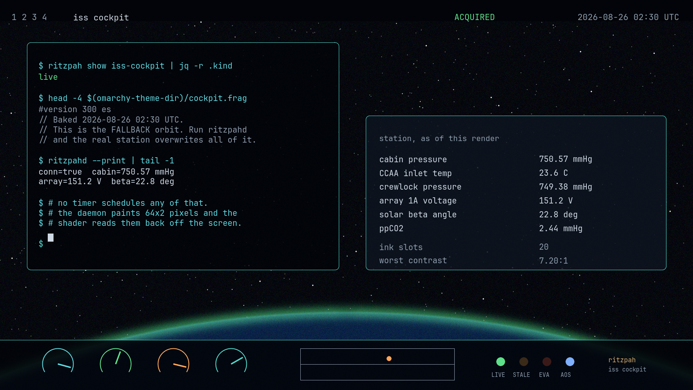

# ISS Cockpit

**A cockpit whose gauges are wired to the real International Space Station.**



Not a space theme. Not a picture of a spacecraft. The needles on the panel are
moved by cabin pressure telemetry that left the station a few seconds ago, and
when the ground track dot crosses the Pacific it is because the station is over
the Pacific.

It is the second `live` theme in this collection, and the first one that talks
to anything.

---

## What is actually live

| Instrument | Source | Moves |
|---|---|---|
| Cabin pressure | `USLAB000058`, LAB PCA | slowly, and in the last decimal constantly |
| CCAA inlet temperature | `USLAB000059` | slowly |
| Crewlock pressure | `AIRLOCK000049` | flat, until an EVA |
| Array 1A voltage | `S4000001` | with the 92-minute day/night cycle |
| Solar beta angle | `USLAB000040` | over weeks |
| Attitude quaternion | `USLAB000018..21` | slowly |
| Position and velocity | `USLAB000032..37` | 7.66 km/s |
| Signal state | `TIME_000001` Status.Class | on every TDRS handover |

The orbital half — ground track, terminator, orbital sunrise, the 45 minutes of
night — is **computed**, not streamed, because streaming a thing you can derive
exactly is worse than deriving it. The elements are baked at Hyprland config
load and propagated on the GPU from `time`.

The effect you will actually notice is not an instrument. **The desktop dims and
goes blue when the station enters eclipse, and warms when it comes out**, forty
five minutes at a time, sixteen times a day. That is the whole theme in one
sentence.

---

## The strip, which is the interesting part

Hyprland binds a **fixed, compiled-in set** of uniforms to a screen shader. In
0.56.2 the enum is exactly:

```
tex   time   wl_output   screen_size   v_texcoord
```

No second sampler. No arbitrary-uniform path. No extension point. So the
obvious way to hand a shader a table of numbers — a data texture — is not
available to any theme that ships as a Hyprland `screen_shader`. That is the
compositor, not a policy.

But `tex` is the composited output. Whatever is on the screen is in it.

So the daemon paints the telemetry into the screen as **actual pixels** — a
64×2 layer-shell surface in the top-left corner — and the shader reads the
screen to find out where the ISS is, then paints over the evidence in the same
pass. Screencopy runs after the screen shader, so the strip is invisible on
screen *and* invisible to `grim`. It exists only in the one frame buffer the
shader is looking at.

Full texel map, encoding, and the three fallback cases: **[TELEMETRY.md](TELEMETRY.md)**.

---

## Running it

The theme works with no daemon at all. That is the state it ships in.

```bash
./ritzpah install iss-cockpit --set
```

You get the cockpit, the orbit, the eclipse cycle and the ground track,
computed locally from a committed element set. The cabin gauges hold their
baked values and the panel lights **STALE**, which is the panel telling you the
truth rather than freezing at a plausible number.

For the live half:

```bash
cd ritzpahd && cargo build --release
./target/release/ritzpahd
```

`ritzpahd --print` streams to stdout with no Wayland surface, which is the
fastest way to confirm the station is talking to you. `ritzpahd --dump` prints
the encoded strip as hex, so the texel map can be checked against the shader
with no compositor, no network and no station.

---

## What it does to your machine

Stated plainly, because this theme does more than a theme should.

**The theme** reads `colors.toml` and `cockpit.frag.in` from its own generated
directory, and writes `cockpit.frag` next to them. That is the entire list. No
network, no subprocess, no timer, no shell hook.

**The daemon** — separate binary, opt-in, started by you — opens one TLS
WebSocket to `push.lightstreamer.com` (public ISSLIVE adapter set; no account,
no key, no credentials), sends nothing but the subscription itself, creates one
64×2 layer-shell surface per output, and **writes nothing to disk, ever**.

Both are in the repo's computed audit surface, which is built by scanning the
files rather than by anyone remembering to write it down.

---

## Contrast

Every one of the 20 ink slots clears **7.0:1**, WCAG AAA, with **no
exemptions** — the only shader theme here that does, and the second theme in
the collection after Blueprint.

That is not restraint sneaking in. A cockpit is a panel someone has to read
correctly while something is going wrong, which is the one context where the
rigour *is* the point. Run `./ritzpah contrast iss-cockpit` and it will print
the real numbers; nothing in this file is a measurement typed by hand.

---

## Wallpapers

Five, all generated: `tools/make-backgrounds-iss-cockpit`. The star fields and
airglow are seeded randomly, so **every run produces a different set in the
same palette**. The recipe is the deliverable.

- **1-orbital-night** — the night side, lit only by airglow at 90 km and cities
- **2-terminator** — orbital sunrise, the ember band that nobody believes
- **3-cupola** — the seven-window Cupola geometry, shutters open
- **4-beta-angle** — the orbit plane against the sun line, labelled not measured
- **5-aurora** — aurora australis, from above, where it is a ribbon and not a curtain

---

## Battery

It costs. `debug:damage_tracking = 0`, because a screen shader only advances
when Hyprland draws a frame, and without full damage the orbit freezes wherever
nothing is happening — and worse, the telemetry strip stops being re-read.

Escape hatch from any catastrophe: `omarchy theme set "Acid Vortex"`.

---

## The fallback orbit drifts

`hyprland.lua` carries a two-line element set for ISS (ZARYA), NORAD 25544. It
is a snapshot: drag lowers the station, the crew reboosts it, and the along
track error grows by roughly a kilometre a day. Invisible on a ground track
dot. Would matter enormously if you were pointing an antenna. You are not.

```bash
./ritzpah iss-tle     # the only networked verb in the collection
```

Look at the diff, then commit it.
