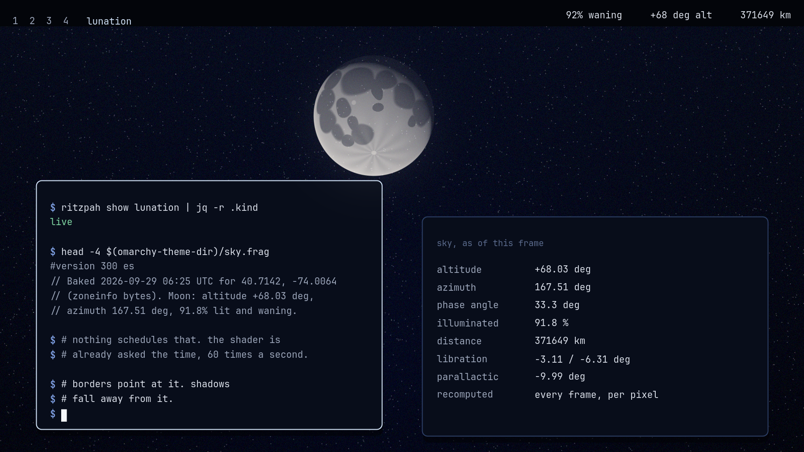

# Lunation

**The real Moon, in its real place in your sky, recomputed every frame.**



Every other theme in this collection is a fixed set of colours that will look
exactly the same in April as it does tonight. This one is `kind: "live"`, and
it is live in the strict sense: it asks where the Moon is, over the machine it
is running on, and dresses the compositor in the answer.

The Moon crosses your desktop. It rises out of the bottom edge in the east,
climbs, transits, sets in the west, and is gone for the rest of the day. Over a
month it fills and empties. When it is up, your window borders take the colour
of moonlight after however much atmosphere it happens to be behind, their
gradient runs toward it, and your window shadows fall away from it. When it is
down, everything goes to earthshine: the ashen blue-grey of sunlight that went
to Earth, bounced off our oceans and cloud, and came back.

None of that is on a timer. There is no daemon, no systemd unit, no shell hook,
nothing at login. See [Where the time comes from](#where-the-time-comes-from),
because that is the actually interesting part.

## What is in here

| File | What it does |
|------|--------------|
| `colors.toml` | The palette. Twenty ink slots, all of them things you can see at night. |
| `hyprland.lua` | The ephemeris. Runs at every Hyprland config load, sets the borders and shadows, writes `sky.frag`. |
| `sky.frag.in` | The screen shader, with holes in it where the numbers go. |
| `sky.frag` | The committed fallback -- Greenwich, and obviously wrong on purpose. |
| `shell.*.toml` | Ten shell surfaces. |
| `backgrounds/` | Five plates, every Moon on them computed rather than photographed. |

## The palette is the sky, not the Moon

The Moon is a rock. Its albedo is about 0.12 and its colour, up close, is the
colour of a dirty parking lot. Apollo 17 brought back samples and they are
grey. A terminal painted honestly in lunar regolith would be a war crime.

So `colors.toml` is the sky the Moon is in, and every ink slot is a real light
source, named in the file where it comes from:

| Slot | Is |
|---|---|
| `accent`, `foreground` | Moonlight: sunlight, off regolith, through air |
| `muted` | Earthshine, the ashen light on the dark limb |
| `red` | Antares. M1 supergiant |
| `orange` | Sodium-vapour skyglow, the 589 nm doublet, from town |
| `yellow` | Capella. G-type, same class as the Sun |
| `green` | Airglow. Atomic oxygen at 557.7 nm, ninety kilometres up |
| `blue` | Rigel. B8, twelve thousand kelvin |
| `magenta` | Aurora, nitrogen at the bottom of the curtain |
| `brown` | The lunar highlands. Anorthosite -- the one slot that is the rock |

Twenty ink slots against `#05070e`, floor 4.5, **worst slot 6.55 and no
exemptions**. That makes it the third theme here to clear its own floor
outright, after Blueprint at 7.04 and Casino Carpet at 4.96. Check it rather
than believe it:

```bash
./ritzpah contrast lunation
```

## Where the time comes from

This is the part worth reading, and it is the reason the theme exists in this
shape rather than as a cron job.

A theme that tracks something outside itself has to be told when that thing
changed. The obvious way is a timer, and the obvious way is wrong here: this
repo publishes its whole audit surface and invites you to check what executes
and when, and a theme that quietly installs a scheduled job is exactly the kind
of thing that page exists to make visible.

So the work is split between two things that were already running.

**Hyprland re-executes `hyprland.lua` at every config load.** That is a real
Lua interpreter with a real standard library, so it can compute a full lunar
ephemeris, and it does: mean arguments, twenty periodic terms in longitude,
eleven in latitude, fourteen in distance, then the equatorial conversion, the
sidereal time, the altitude and azimuth, the elongation, the phase angle, the
illuminated fraction and the optical libration. From that it derives the border
colours, the gradient angle, the shadow offset and the inactive-dim strength,
and hands them to `hl.config`.

**A screen shader is handed the wall clock sixty times a second.** Hyprland
gives every screen shader a `time` uniform. So `hyprland.lua` bakes the *linear*
part of the model into `sky.frag` -- the mean arguments at that instant, and
their rates per day, which is the part of celestial mechanics that is boring
and exact -- and the shader recomputes everything non-linear from `time`
itself: the periodic terms, the hour angle, the phase, the extinction, the
libration, the position of the terminator.

Net effect: the sky stays correct for as long as the compositor runs, whether
that is an hour or three weeks, and **nothing needed to be scheduled, because
the shader was already asking what time it is.**

There is one trick holding it together. `time` is seconds since the compositor
started, not since the shader loaded, so the shader cannot turn it into a date
on its own. But `HYPRLAND_INSTANCE_SIGNATURE` carries the unix timestamp the
compositor started at, in its middle field. The Lua reads it, subtracts, and
bakes `T_LOAD` -- what the shader's own clock will read at the instant the file
was written. After that the shader knows the date, exactly, forever.

## Where you are

The Moon's altitude depends on your latitude, and nobody wants to configure
their latitude to install a theme. So:

1. `~/.config/omarchy/lunation.conf`, if you made one:
   ```
   lat = 40.7128
   lon = -74.0060
   ```
   Longitude is east-positive. This is the override, and it is the only reason
   the file exists.
2. Otherwise, your timezone -- because tzdata ships coordinates for every zone
   in `/usr/share/zoneinfo/zone1970.tab`. Those coordinates are the centre of
   the zone's largest city, so they can be a couple of hundred kilometres out.
   For the Moon that is worth well under a degree of altitude, which is less
   than the refraction at the horizon. It does not matter.
3. Otherwise, the Royal Observatory, Greenwich, which is the correct place to
   be when nobody knows where you are.

Getting the zone name is its own small indignity. `/etc/localtime` is a symlink
and **Lua cannot read a symlink** -- there is no `readlink` in the standard
library. It can read bytes, though, and the file is byte-identical to the
zoneinfo file it points at. So the theme identifies your timezone by matching
the contents of `/etc/localtime` against the zoneinfo tree. About three hundred
small reads, once, when Hyprland loads its config. `TZ` and `/etc/timezone` are
checked first, because when they exist they are free.

## The Moon itself

The disc is drawn, not textured. There is no image file anywhere in this theme
of the Moon, because a texture would have to come from somewhere and nothing in
this repo fetches anything from anywhere.

What is in the shader instead:

- **Twenty-four maria and four rayed craters**, stored as unit vectors in the
  selenographic frame with the cosine of an angular radius in `w`. Testing
  whether a pixel is inside Mare Imbrium is then one dot product and one
  smoothstep, no inverse trigonometry, twenty-eight times per fragment. Radii
  are the real diameters over the real lunar radius, which is why Imbrium is a
  third of the way across the face and Sinus Medii is a freckle.
- **Lommel-Seeliger scattering**, not Lambert. Lunar regolith backscatters, and
  that is why a full Moon looks like a flat disc rather than a lit ball. Get
  this wrong and you get a Christmas bauble.
- **The opposition surge.** Shadow-hiding at small phase angles, which is why
  a full Moon is more than twice as bright as a half Moon rather than exactly
  twice.
- **Earthshine** on the unlit limb, scaled by `1 - k`, because the Earth is
  full as seen from the Moon exactly when the Moon is new as seen from here.
- **The optical libration.** The Moon nods about eight degrees each way over a
  month, which is how anyone has ever seen fifty-nine percent of a body that is
  supposedly tidally locked. The face you are looking at is the face that is
  turned toward you tonight.
- **The parallactic angle**, so the Moon lies over on its side through the
  night by exactly as much as it really does. This is the detail nobody notices
  and everybody would notice the absence of.
- **Atmospheric extinction**, per channel: 0.36 magnitudes per airmass in blue,
  0.20 in green, 0.11 in red, on Rozenberg's airmass so it stays finite through
  the horizon. That difference is the entire reason a Moon on the horizon is
  orange, and it is why the borders go warm at moonrise on their own.

The one thing not to scale is the disc, which is drawn about ninety times
oversize -- across a screen mapped to the full 360 degrees of the horizon, half
a degree is three pixels. Its size still tracks the true angular diameter, so
perigee really is larger than apogee by the real five and a half percent.

## How it is composited

The shader only ever sees the finished frame. It has no idea what a window is.
So it adds light where the frame is dark, gated on the square of one minus the
luminance of what is already there -- which means it pours over the wallpaper
and the dark insides of your cards, does nothing at all to text, and leaves the
Moon looking like it is *behind* your windows. Which it is.

## The wallpapers

Five plates, in `backgrounds/`. Every Moon on all of them is computed by the
same model, in Python instead of GLSL.

| Plate | Is |
|---|---|
| `1-lunation` | One synodic month. Thirty discs, each at the phase, distance and libration it really has that day. |
| `2-transit` | One real night at your latitude, on the same projection the shader uses, ninety minutes apart. |
| `3-terminator` | One very large crescent, close enough that it is the only thing on the plate. |
| `4-earthshine` | The old Moon in the new Moon's arms. Nearly black, because that is what honest looks like here. |
| `5-libration` | Six full Moons over a month. Watch Mare Crisium walk toward the limb and back. |

```bash
tools/make-backgrounds-lunation                     # 2560x1440, about ninety seconds
tools/make-backgrounds-lunation [dir] [W] [H]
```

**The plates are dated.** `1-lunation` is the month that contains the day you
ran it, and `2-transit` is a real night at your real coordinates. Run it in June
and again in December and you get different skies, because they were different
skies. The recipe is the deliverable; a particular set of images never was.

It is slow, and it is slow on the CPU. Ten million lunar surface points, each
getting its own incidence angle, in pure Python. That was a choice: the model
had to be readable next to the GLSL, and it is.

## Is it right?

The ephemeris is a truncation of Meeus, *Astronomical Algorithms*, chapters 22,
25, 47 and 53. All three implementations -- Lua, GLSL and Python -- are checked
against his worked example 47.a, 1992 April 12.0 TD:

| | This | Meeus |
|---|---|---|
| λ | 133.157° | 133.162655° |
| β | −3.2309° | −3.229126° |
| Δ | 368413 km | 368409.7 km |

Twenty arcseconds and four kilometres, on a body 1900 arcseconds across at
384000 km. The shader keeps fewer terms than the Lua does -- six of sixty in
longitude -- and is correspondingly coarser, at something under a tenth of a
degree. You are looking at a wallpaper.

What it does **not** model, in case you were about to file a bug: nutation,
aberration, topocentric parallax (about a degree at the horizon), physical as
opposed to optical libration, and refraction beyond a hand-waved half degree at
the horizon. Also there is no Sun in the shader. The Moon is up during the day
about half the time, and when it is up, this theme shows it, which is more
honest than most planetaria manage.

## What it costs

Battery. Two reasons, and it is worth being exact about which is which.

**The first is not the astronomy.** A screen shader only advances when Hyprland
draws a frame, and by default Hyprland only redraws what changed -- so on a
still screen the sky would freeze in whatever region nothing is happening, and
the Moon would be cut into rectangles that each believed a different time. The
theme sets `debug { damage_tracking = 0 }` to force the whole output every
frame. That is the cost, and it is the same cost Cathode and Ego Death pay.

**The second is the astronomy, and it is real.** The ephemeris is evaluated
once per *pixel*. Roughly forty transcendentals per fragment that are identical
across the entire frame, three and a half million times. There is no uniform to
hoist them into and no vertex stage worth abusing. It is absurd. It is also
unavoidable, and it is the funniest line in the theme.

If you want the sky without the melt, delete the `screen_shader` line from
`hyprland.lua`. The borders, the gradient angle, the shadow direction and the
dim strength are all set by the Lua and cost nothing at all -- you keep a
desktop that is lit from wherever the Moon actually is, refreshed whenever
Hyprland reloads its config, at zero frames per second of overhead.

## Escape hatch

```bash
omarchy theme set "Acid Vortex"
```

A theme switch reloads Hyprland's config, which resets the shader and damage
tracking to defaults.

## What it touches

The whole list, since this theme executes more than a theme normally should and
you should not have to grep for it:

```
reads   /etc/localtime, /etc/timezone, $TZ
reads   /usr/share/zoneinfo/zone1970.tab
reads   ~/.config/omarchy/lunation.conf   (if you made one)
reads   <generated theme dir>/sky.frag.in
writes  <generated theme dir>/sky.frag
```

`<generated theme dir>` is `~/.local/state/omarchy/current/theme`, which is
Omarchy's own working copy of the current theme and is rebuilt from scratch
every time you switch themes. Nothing here writes to
`~/.config/omarchy/themes`, nothing writes outside that one directory, and
nothing opens a socket.
