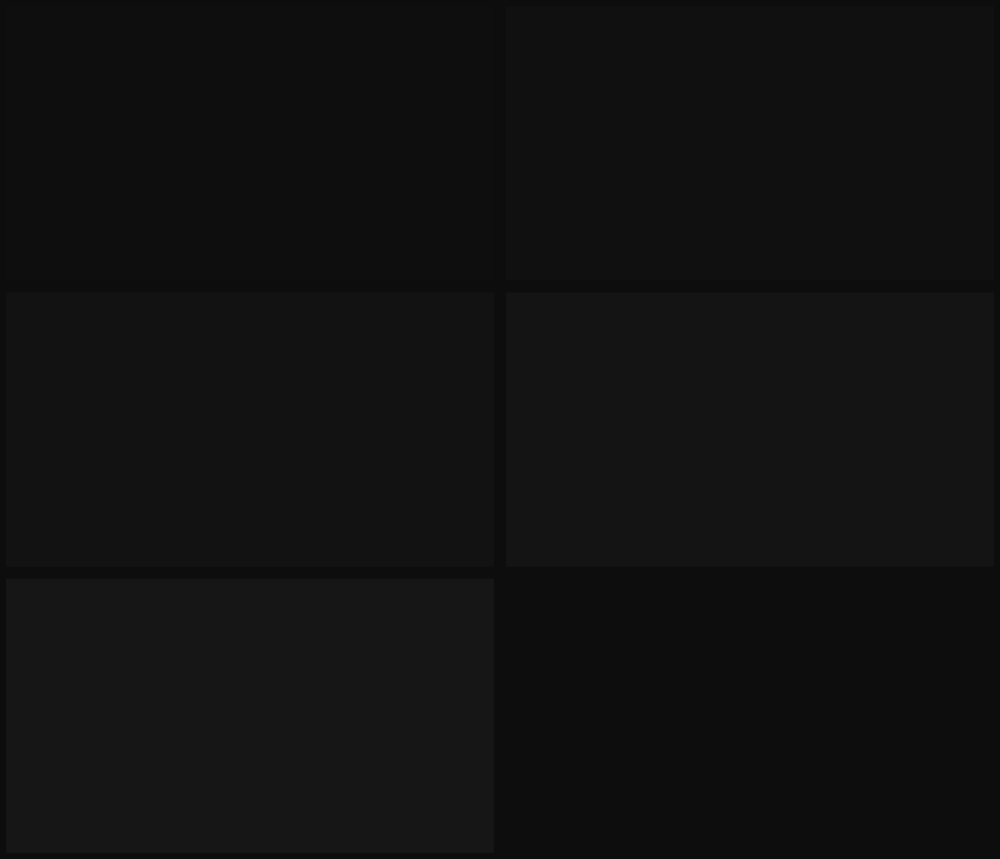

# Untitled

The most themeless theme ever themed.

That is the wallpaper. It is not a placeholder for the wallpaper.

## Why this isn't just `colors.toml`

Omarchy needs exactly one file to call something a theme, and a truly themeless
theme could plausibly be that one file and nothing else. It isn't, because
shipping only `colors.toml` doesn't get you *no theme* — it gets you Omarchy's
defaults, which are:

- a 2px border in a two-stop cyan-to-green gradient at 45°,
- fourteen animation leaves with five bezier curves,
- a launcher at 0.95 alpha and a tooltip at 0.97,
- and a `[menu]` whose selected row is tinted with your accent color.

Restrained, tasteful, and still a look. Every file in this directory exists to
take one of those away. Doing nothing is the one thing you cannot do by
default; it has to be spelled out surface by surface.

## The palette

Hue is discarded. What survives is the *order* hue used to imply.

The eight canonical vivid sRGB primaries and secondaries are ranked by Rec.709
luma, and the ranks are dealt onto an evenly spaced band of neutral grays:

| Slot | Was | Luma | Gray | Contrast on `#121212` |
|------|-----|------|------|-----------------------|
| `blue` | `#0000ff` | 0.072 | `#7c7c7c` | 4.5:1 |
| `red` | `#ff0000` | 0.213 | `#898989` | 5.4:1 |
| `brown` | `#a52a2a` | 0.267 | `#959595` | 6.3:1 |
| `magenta` | `#ff00ff` | 0.285 | `#a2a2a2` | 7.4:1 |
| `orange` | `#ff8000` | 0.572 | `#aeaeae` | 8.6:1 |
| `green` | `#00ff00` | 0.715 | `#bbbbbb` | 9.9:1 |
| `cyan` | `#00ffff` | 0.787 | `#c7c7c7` | 11.1:1 |
| `yellow` | `#ffff00` | 0.928 | `#d4d4d4` | 12.6:1 |

Bright variants are the same gray, 22 levels lighter. That is the entire
difference between `red` and `bright_red`.

Nothing in that table was chosen by eye, and the band's two ends aren't either.
The floor `#7c7c7c` is the darkest gray that still clears 4.5:1 against the
background — picked by WCAG, not by taste. The ceiling `#d4d4d4` is as high as
the normal set can sit and still leave the brights room under white.
Regenerate the whole file with `tools/make-palette-untitled`; hand-tuning it
would be a theme.

### Two things this costs you

**Your errors are dimmer than your warnings.** Luma order puts red near the
bottom of the band and yellow at the top, so a compiler error reads quieter
than the warning above it. That is what happens when you let physics rank your
palette instead of convention.

**Blue and comments are the same gray.** `blue` lands on `#7c7c7c`, and
`dark_foreground` — comments, in every generated editor theme — sits on the
same value, because both are pinned to the 4.5:1 floor from opposite
directions. In most syntax themes blue is types or keywords, so in some
languages a keyword and the comment beside it are now indistinguishable. Bump
`blue` a step if that bothers you; it bothered me for about a day.

## Everything else, removed

| Thing | Value | Because |
|-------|-------|---------|
| `border_size` | 1 | enough to find a window edge, not enough to be a design element |
| active border | one flat `rgba(5a5a5aff)` | a gradient is a point of view |
| `rounding` | 0 | |
| `shadow` | off | depth is a claim about layers |
| `blur` | off | and so nothing behind a surface bleeds into it |
| `dim_inactive` | off | the border already says which window is focused |
| `animations.enabled` | **false** | |

That last one is the one you feel. Not "fast animations" — none. Windows are
where they are going to be on the frame they are asked to be there, workspaces
cut rather than slide, and the launcher does not grow into place. On this
hardware it reads as the machine being about 80ms quicker than it was, which it
isn't.

Omarchy loads a theme's `hyprland.lua` *before* `~/.config/hypr/looknfeel.lua`,
so this is all opt-out: whatever gaps, opacity, or per-window rounding you set
personally still win. The theme won't fight your config, which means it also
can't guarantee the result is themeless. That part is on you.

## Shell

Every surface is fully opaque — `background-alpha = 1.0` everywhere, no frost,
no layer rule, nothing to see through. Interactive states don't change color;
they change *how much* of the same gray is present:

| State | Fill | Border |
|-------|------|--------|
| normal | 0.0 | `#3a3a3a` |
| hover / focus | 0.06 | `#5a5a5a` / `#8a8a8a` |
| selected | 0.16 | `#8a8a8a` |
| pressed | 0.24 | — |

**The one place the theme flinches.** A failed password prompt and a lock-screen
error are `#ffffff`, not the theme's red — because the theme's red is `#898989`,
which is dimmer than body text. An error that recedes is worse than an
inconsistency, so `shell.polkit.toml` and `shell.lock.toml` break the rule on
purpose. Same reasoning for the bar's `active` (recording, alerts, updates):
with no red to raise, attention is spelled with brightness.

## Wallpapers

| | |
|---|---|
| `1-untitled` | `#0e0e0e` |
| `2-untitled-1` | `#101010` |
| `3-untitled-final` | `#121212` |
| `4-untitled-final-2` | `#141414` |
| `5-untitled-final-FINAL` | `#161616` |

Five flat neutral fields, two 8-bit levels apart, centred on the theme
background. `omarchy theme bg next` works exactly as it does under any other
theme. You will never be able to tell that it did.

They carry a half-step of Gaussian grain, which is the only texture in the
theme and is below the threshold of vision on any panel you own. It isn't
decoration: a perfectly flat field is the worst case for JPEG's 8×8 DCT at the
quantiser's edge, and a 16-shade neighbourhood bands visibly on OLED. The grain
dithers both away. Regenerate with `tools/make-backgrounds-untitled`.

## Turning it up

| Change | Effect |
|--------|--------|
| delete `animations = { enabled = false }` | Omarchy's default fourteen leaves come back |
| raise `blue` above `#7c7c7c` | keywords stop colliding with comments |
| swap `red` and `yellow` in the band | errors outrank warnings again, at the cost of the derivation |
| `border_size = 2`, put a second stop back | a border you notice |
| any `background-alpha` below 1.0 | the wallpaper starts participating |

Or leave: `omarchy theme set "Acid Vortex"`. There is a whole spinning rainbow
in the next directory over.
